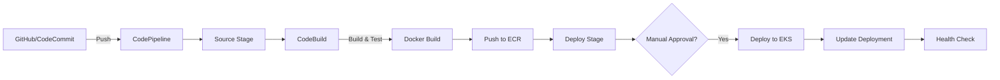

# AWS CI/CD Toolchain

## What You'll Learn
- Build a complete AWS-native CI/CD pipeline using CodePipeline
- Use CodeBuild for Docker image builds and testing
- Store container images in Amazon ECR (Elastic Container Registry)
- Deploy applications to Amazon EKS (Elastic Kubernetes Service)
- Implement approval stages and rollback mechanisms
- Integrate with GitHub/Bitbucket for source control

## Overview

**AWS CI/CD Toolchain** provides a fully managed, serverless CI/CD platform with deep integration into the AWS ecosystem. Unlike third-party tools, AWS CodePipeline scales automatically, requires no server maintenance, and integrates seamlessly with IAM for security.

**Why it matters**: For AWS-centric organizations, native tools eliminate external dependencies, reduce costs (pay only for pipeline runs), and provide built-in compliance with AWS security standards (SOC, PCI-DSS, HIPAA).

## Architecture / Flow



## Complete Pipeline Setup

### Step 1: Create ECR Repository

```bash
# Create repository for Docker images
aws ecr create-repository \
  --repository-name myapp \
  --region us-east-1

# Get repository URI
export ECR_REPO=$(aws ecr describe-repositories \
  --repository-names myapp \
  --query 'repositories[0].repositoryUri' \
  --output text)

echo $ECR_REPO
# Output: 123456789012.dkr.ecr.us-east-1.amazonaws.com/myapp
```

### Step 2: CodeBuild Project

#### buildspec.yml (in your repo root)

```yaml
version: 0.2

phases:
  pre_build:
    commands:
      # Login to ECR
      - echo Logging in to Amazon ECR...
      - aws ecr get-login-password --region $AWS_DEFAULT_REGION | docker login --username AWS --password-stdin $AWS_ACCOUNT_ID.dkr.ecr.$AWS_DEFAULT_REGION.amazonaws.com
      
      # Set image tag (commit SHA)
      - IMAGE_TAG=${CODEBUILD_RESOLVED_SOURCE_VERSION:0:7}
      - echo "IMAGE_TAG=$IMAGE_TAG"
  
  build:
    commands:
      # Run tests
      - echo Running unit tests...
      - npm test
      
      # Build Docker image
      - echo Building Docker image...
      - docker build -t $IMAGE_REPO_NAME:$IMAGE_TAG .
      - docker tag $IMAGE_REPO_NAME:$IMAGE_TAG $AWS_ACCOUNT_ID.dkr.ecr.$AWS_DEFAULT_REGION.amazonaws.com/$IMAGE_REPO_NAME:$IMAGE_TAG
      - docker tag $IMAGE_REPO_NAME:$IMAGE_TAG $AWS_ACCOUNT_ID.dkr.ecr.$AWS_DEFAULT_REGION.amazonaws.com/$IMAGE_REPO_NAME:latest
  
  post_build:
    commands:
      # Push to ECR
      - echo Pushing Docker image to ECR...
      - docker push $AWS_ACCOUNT_ID.dkr.ecr.$AWS_DEFAULT_REGION.amazonaws.com/$IMAGE_REPO_NAME:$IMAGE_TAG
      - docker push $AWS_ACCOUNT_ID.dkr.ecr.$AWS_DEFAULT_REGION.amazonaws.com/$IMAGE_REPO_NAME:latest
      
      # Create imagedefinitions.json for ECS (if using ECS instead of EKS)
      - printf '[{"name":"%s","imageUri":"%s"}]' $CONTAINER_NAME $AWS_ACCOUNT_ID.dkr.ecr.$AWS_DEFAULT_REGION.amazonaws.com/$IMAGE_REPO_NAME:$IMAGE_TAG > imagedefinitions.json

artifacts:
  files:
    - imagedefinitions.json
    - k8s/*.yaml  # Kubernetes manifests

cache:
  paths:
    - '/root/.npm/**/*'  # Cache npm modules
    - '/root/.cache/**/*'  # Cache Docker layers
```

#### Create CodeBuild Project (CLI)

```bash
aws codebuild create-project \
  --name myapp-build \
  --source type=GITHUB,location=https://github.com/myorg/myapp.git \
  --artifacts type=NO_ARTIFACTS \
  --environment type=LINUX_CONTAINER,image=aws/codebuild/standard:7.0,computeType=BUILD_GENERAL1_SMALL,privilegedMode=true \
  --environment-variables \
      name=AWS_DEFAULT_REGION,value=us-east-1 \
      name=AWS_ACCOUNT_ID,value=123456789012 \
      name=IMAGE_REPO_NAME,value=myapp \
      name=CONTAINER_NAME,value=myapp \
  --service-role arn:aws:iam::123456789012:role/CodeBuildServiceRole
```

### Step 3: CodePipeline Setup

#### Create Pipeline (AWS Console)

1. **Navigate to CodePipeline** → Create pipeline
2. **Pipeline name**: `myapp-pipeline`
3. **Service role**: New service role (auto-created)
4. **Artifact store**: Default S3 bucket

#### Source Stage

- **Source provider**: GitHub (Version 2) or AWS CodeCommit
- **Repository**: `myorg/myapp`
- **Branch**: `main`
- **Change detection**: CloudWatch Events (webhook)

#### Build Stage

- **Build provider**: AWS CodeBuild
- **Project name**: `myapp-build`
- **Build type**: Single build

#### Deploy Stage (to EKS)

- **Deploy provider**: Amazon EKS
- **Cluster name**: `prod-cluster`
- **Service name**: `myapp-service`
- **Image definition file**: `imagedefinitions.json`

### Step 4: Deploy to EKS

#### EKS Deployment Manifest (k8s/deployment.yaml)

```yaml
apiVersion: apps/v1
kind: Deployment
metadata:
  name: myapp
  namespace: production
spec:
  replicas: 3
  selector:
    matchLabels:
      app: myapp
  template:
    metadata:
      labels:
        app: myapp
    spec:
      containers:
      - name: myapp
        image: 123456789012.dkr.ecr.us-east-1.amazonaws.com/myapp:latest
        ports:
        - containerPort: 8080
        env:
        - name: NODE_ENV
          value: "production"
        resources:
          requests:
            cpu: 250m
            memory: 512Mi
          limits:
            cpu: 500m
            memory: 1Gi
        livenessProbe:
          httpGet:
            path: /health
            port: 8080
          initialDelaySeconds: 30
          periodSeconds: 10
        readinessProbe:
          httpGet:
            path: /ready
            port: 8080
          initialDelaySeconds: 5
          periodSeconds: 5
---
apiVersion: v1
kind: Service
metadata:
  name: myapp-service
  namespace: production
spec:
  type: LoadBalancer
  selector:
    app: myapp
  ports:
  - port: 80
    targetPort: 8080
```

#### Deploy Script (in CodeBuild post_build)

```bash
# post_build commands in buildspec.yml
- echo Deploying to EKS...
- aws eks update-kubeconfig --name prod-cluster --region us-east-1
- kubectl apply -f k8s/deployment.yaml
- kubectl set image deployment/myapp myapp=$AWS_ACCOUNT_ID.dkr.ecr.$AWS_DEFAULT_REGION.amazonaws.com/$IMAGE_REPO_NAME:$IMAGE_TAG -n production
- kubectl rollout status deployment/myapp -n production
```

## Manual Approval Stage

Add approval between staging and production:

1. **Edit pipeline** → Add stage (after Deploy-Staging)
2. **Stage name**: `Approval`
3. **Action provider**: Manual approval
4. **SNS topic**: `arn:aws:sns:us-east-1:123456789012:pipeline-approvals`
5. **Notification**: Email DevOps team
6. **Approval timeout**: 7 days

**Approval email includes**:
- Pipeline name
- Commit message
- Artifacts (links to S3)
- **Review** button (approve/reject)

## Blue-Green Deployment on EKS

```bash
# Create two deployments: blue (current) and green (new)
# Switch traffic via Service selector

# Deploy green version
kubectl apply -f k8s/deployment-green.yaml

# Test green deployment
kubectl port-forward deployment/myapp-green 8080:8080
curl http://localhost:8080/health

# Switch traffic to green
kubectl patch service myapp-service -p '{"spec":{"selector":{"version":"green"}}}'

# Monitor for 10 minutes, then delete blue deployment
kubectl delete deployment myapp-blue
```

## Rollback Strategies

### Quick Rollback (kubectl)

```bash
# View deployment history
kubectl rollout history deployment/myapp -n production

# Rollback to previous version
kubectl rollout undo deployment/myapp -n production

# Rollback to specific revision
kubectl rollout undo deployment/myapp --to-revision=2 -n production
```

### CodePipeline Rollback

```bash
# Re-run previous successful pipeline execution
aws codepipeline start-pipeline-execution \
  --name myapp-pipeline \
  --source-revisions actionName=Source,revisionType=COMMIT_ID,revisionValue=abc123def456
```

## IAM Permissions

### CodeBuild Service Role

```json
{
  "Version": "2012-10-17",
  "Statement": [
    {
      "Effect": "Allow",
      "Action": [
        "ecr:GetAuthorizationToken",
        "ecr:BatchCheckLayerAvailability",
        "ecr:GetDownloadUrlForLayer",
        "ecr:PutImage",
        "ecr:InitiateLayerUpload",
        "ecr:UploadLayerPart",
        "ecr:CompleteLayerUpload"
      ],
      "Resource": "*"
    },
    {
      "Effect": "Allow",
      "Action": [
        "logs:CreateLogGroup",
        "logs:CreateLogStream",
        "logs:PutLogEvents"
      ],
      "Resource": "*"
    },
    {
      "Effect": "Allow",
      "Action": [
        "s3:GetObject",
        "s3:PutObject"
      ],
      "Resource": "arn:aws:s3:::codepipeline-*/*"
    }
  ]
}
```

### CodePipeline Service Role

```json
{
  "Version": "2012-10-17",
  "Statement": [
    {
      "Effect": "Allow",
      "Action": [
        "codebuild:StartBuild",
        "codebuild:BatchGetBuilds"
      ],
      "Resource": "*"
    },
    {
      "Effect": "Allow",
      "Action": [
        "eks:DescribeCluster",
        "eks:DescribeUpdate"
      ],
      "Resource": "*"
    },
    {
      "Effect": "Allow",
      "Action": [
        "iam:PassRole"
      ],
      "Resource": "*",
      "Condition": {
        "StringEquals": {
          "iam:PassedToService": "ecs-tasks.amazonaws.com"
        }
      }
    }
  ]
}
```

## Cost Optimization

| Service | Pricing | Optimization |
|---------|---------|--------------|
| **CodePipeline** | $1/active pipeline/month | Use single pipeline with multiple stages |
| **CodeBuild** | $0.005/build minute (small) | Use caching, optimize Dockerfile layers |
| **ECR** | $0.10/GB/month storage | Delete old images (lifecycle policies) |
| **EKS** | $0.10/hour cluster + EC2 costs | Use Fargate for bursty workloads |

### ECR Lifecycle Policy (auto-delete old images)

```json
{
  "rules": [
    {
      "rulePriority": 1,
      "description": "Keep last 10 images",
      "selection": {
        "tagStatus": "any",
        "countType": "imageCountMoreThan",
        "countNumber": 10
      },
      "action": {
        "type": "expire"
      }
    }
  ]
}
```

Apply policy:
```bash
aws ecr put-lifecycle-policy \
  --repository-name myapp \
  --lifecycle-policy-text file://lifecycle-policy.json
```

## Monitoring & Alerts

### CloudWatch Dashboard

```bash
# Create custom dashboard
aws cloudwatch put-dashboard \
  --dashboard-name MyApp-Pipeline \
  --dashboard-body '{
    "widgets": [
      {
        "type": "metric",
        "properties": {
          "metrics": [
            ["AWS/CodePipeline", "PipelineExecutionSuccess", {"stat": "Sum"}],
            [".", "PipelineExecutionFailure", {"stat": "Sum"}]
          ],
          "period": 300,
          "stat": "Average",
          "region": "us-east-1",
          "title": "Pipeline Success/Failure"
        }
      }
    ]
  }'
```

### SNS Notifications

```bash
# Create SNS topic for pipeline notifications
aws sns create-topic --name pipeline-notifications

# Subscribe email
aws sns subscribe \
  --topic-arn arn:aws:sns:us-east-1:123456789012:pipeline-notifications \
  --protocol email \
  --notification-endpoint devops@company.com

# Create CloudWatch Events rule
aws events put-rule \
  --name pipeline-state-change \
  --event-pattern '{
    "source": ["aws.codepipeline"],
    "detail-type": ["CodePipeline Pipeline Execution State Change"],
    "detail": {
      "state": ["FAILED", "SUCCEEDED"]
    }
  }' \
  --state ENABLED

# Add SNS as target
aws events put-targets \
  --rule pipeline-state-change \
  --targets "Id"="1","Arn"="arn:aws:sns:us-east-1:123456789012:pipeline-notifications"
```

## Best Practices

1. **Use Git tags for releases**: Tag commits, use in CodePipeline source
2. **Cache dependencies**: Speed up builds with CodeBuild cache
3. **Separate staging and prod pipelines**: Reduce blast radius
4. **Encrypt artifacts**: Use KMS for S3 artifact buckets
5. **Least privilege IAM**: Grant only required permissions
6. **Monitor costs**: Set CloudWatch billing alarms
7. **Implement rollback**: Automate rollback on health check failures

## FAQs

**Q: CodePipeline vs Jenkins?**  
A: CodePipeline is fully managed (no servers), scales automatically, but less flexible than Jenkins.

**Q: Can I use GitHub Actions for source stage?**  
A: Yes, trigger CodePipeline via webhook from GitHub Actions.

**Q: How do I handle secrets?**  
A: Use AWS Secrets Manager or SSM Parameter Store, reference in buildspec.

**Q: Can I deploy to on-premise servers?**  
A: Yes, use CodeDeploy with on-premise agents.

## Further Reading

- [AWS CodePipeline Documentation](https://aws.amazon.com/codepipeline/)
- [AWS CodeBuild User Guide](https://docs.aws.amazon.com/codebuild/)
- [Amazon EKS Best Practices](https://aws.github.io/aws-eks-best-practices/)
