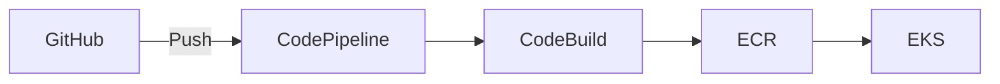

# AWS CI/CD Toolchain

## Architecture



## CodeBuild Example

```yaml
version: 0.2
phases:
  build:
    commands:
      - docker build -t myapp .
      - docker tag myapp:latest $ECR_REPO:$CODEBUILD_RESOLVED_SOURCE_VERSION
  post_build:
    commands:
      - docker push $ECR_REPO:$CODEBUILD_RESOLVED_SOURCE_VERSION
```

## Further Reading

- [AWS CodePipeline Documentation](https://aws.amazon.com/codepipeline/)
