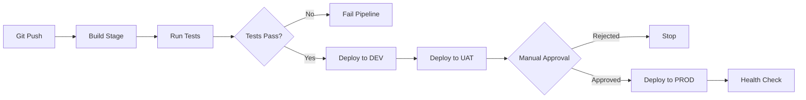

# Azure DevOps Pipelines — Multistage Releases

## What You'll Learn
- How to build multistage Azure DevOps pipelines using YAML
- Configure deployment strategies (runOnce, canary, rolling)
- Set up manual approval gates and pre/post-deployment checks
- Manage environments and variable groups
- Integrate Azure services (App Service, AKS, VM deployments)

## Overview

**Azure DevOps Pipelines** provide enterprise-grade CI/CD with YAML-defined workflows that support complex multistage releases. Unlike GitHub Actions, Azure Pipelines excel at **enterprise environments** with built-in approval workflows, extensive Azure service integrations, and robust variable/secret management.

**Why it matters**: Azure Pipelines offer first-class support for .NET/Java enterprise applications, tight integration with Azure services, and granular permission controls required for regulated industries (finance, healthcare, government).

## Architecture / Flow



## Multistage Pipeline Structure

### Complete Pipeline Example

```yaml
# azure-pipelines.yml
trigger:
  branches:
    include:
      - main
      - develop
  paths:
    exclude:
      - docs/*
      - README.md

variables:
  buildConfiguration: 'Release'
  azureSubscription: 'Production-Subscription'

stages:
  # ===== BUILD STAGE =====
  - stage: Build
    displayName: 'Build & Test'
    jobs:
      - job: BuildJob
        displayName: 'Build Application'
        pool:
          vmImage: 'ubuntu-latest'
        steps:
          - task: UseDotNet@2
            inputs:
              version: '8.x'
          
          - task: DotNetCoreCLI@2
            displayName: 'Restore NuGet packages'
            inputs:
              command: 'restore'
              projects: '**/*.csproj'
          
          - task: DotNetCoreCLI@2
            displayName: 'Build solution'
            inputs:
              command: 'build'
              arguments: '--configuration $(buildConfiguration)'
          
          - task: DotNetCoreCLI@2
            displayName: 'Run unit tests'
            inputs:
              command: 'test'
              arguments: '--configuration $(buildConfiguration) --collect:"XPlat Code Coverage"'
          
          - task: PublishCodeCoverageResults@1
            inputs:
              codeCoverageTool: 'Cobertura'
              summaryFileLocation: '$(Agent.TempDirectory)/**/coverage.cobertura.xml'
          
          - task: DotNetCoreCLI@2
            displayName: 'Publish artifacts'
            inputs:
              command: 'publish'
              publishWebProjects: true
              arguments: '--configuration $(buildConfiguration) --output $(Build.ArtifactStagingDirectory)'
          
          - task: PublishBuildArtifacts@1
            inputs:
              PathtoPublish: '$(Build.ArtifactStagingDirectory)'
              ArtifactName: 'drop'

  # ===== DEV DEPLOYMENT =====
  - stage: DeployDev
    displayName: 'Deploy to DEV'
    dependsOn: Build
    condition: succeeded()
    jobs:
      - deployment: DeployDevJob
        displayName: 'Deploy to Development'
        pool:
          vmImage: 'ubuntu-latest'
        environment: 'dev'
        strategy:
          runOnce:
            deploy:
              steps:
                - task: AzureWebApp@1
                  displayName: 'Deploy to Azure App Service'
                  inputs:
                    azureSubscription: '$(azureSubscription)'
                    appName: 'myapp-dev'
                    package: '$(Pipeline.Workspace)/drop/**/*.zip'
                    deploymentMethod: 'auto'

  # ===== UAT DEPLOYMENT =====
  - stage: DeployUAT
    displayName: 'Deploy to UAT'
    dependsOn: DeployDev
    jobs:
      - deployment: DeployUATJob
        pool:
          vmImage: 'ubuntu-latest'
        environment: 'uat'
        strategy:
          runOnce:
            preDeploy:
              steps:
                - script: echo "Running pre-deployment validation"
            deploy:
              steps:
                - task: AzureWebApp@1
                  inputs:
                    azureSubscription: '$(azureSubscription)'
                    appName: 'myapp-uat'
                    package: '$(Pipeline.Workspace)/drop/**/*.zip'
            postRouteTraffic:
              steps:
                - task: InvokeRESTAPI@1
                  displayName: 'Smoke test'
                  inputs:
                    serviceConnection: 'uat-api'
                    method: 'GET'
                    urlSuffix: '/health'

  # ===== PROD DEPLOYMENT =====
  - stage: DeployProd
    displayName: 'Deploy to Production'
    dependsOn: DeployUAT
    jobs:
      - deployment: DeployProdJob
        pool:
          vmImage: 'ubuntu-latest'
        environment: 'production'  # Manual approval required (configured in portal)
        strategy:
          canary:  # Canary deployment strategy
            increments: [10, 25, 50, 100]
            preDeploy:
              steps:
                - script: echo "Starting canary deployment"
            deploy:
              steps:
                - task: AzureWebApp@1
                  inputs:
                    azureSubscription: '$(azureSubscription)'
                    appName: 'myapp-prod'
                    package: '$(Pipeline.Workspace)/drop/**/*.zip'
                    deploymentMethod: 'zipDeploy'
                    slotName: 'staging'  # Deploy to staging slot first
            routeTraffic:
              steps:
                - task: AzureAppServiceManage@0
                  displayName: 'Swap slots'
                  inputs:
                    azureSubscription: '$(azureSubscription)'
                    appName: 'myapp-prod'
                    resourceGroupName: 'prod-rg'
                    sourceSlot: 'staging'
                    targetSlot: 'production'
                    action: 'Swap Slots'
            postRouteTraffic:
              steps:
                - script: |
                    curl -f https://myapp-prod.azurewebsites.net/health || exit 1
                  displayName: 'Health check'
```

## Deployment Strategies

### 1. runOnce (Default)
```yaml
strategy:
  runOnce:
    preDeploy:
      steps:
        - script: echo "Pre-deploy tasks"
    deploy:
      steps:
        - task: AzureWebApp@1
    postRouteTraffic:
      steps:
        - script: echo "Post-deploy validation"
```

**Use case**: Simple deployments, non-critical services

### 2. Canary
```yaml
strategy:
  canary:
    increments: [10, 25, 50, 100]  # % of traffic
    preDeploy:
      steps:
        - script: echo "Starting canary"
    deploy:
      steps:
        - task: AzureWebApp@1
    routeTraffic:
      steps:
        - script: echo "Routing $(strategy.increment)% traffic"
    on:
      failure:
        steps:
          - script: echo "Rollback initiated"
      success:
        steps:
          - script: echo "Canary successful"
```

**Use case**: High-traffic production systems, gradual rollout

### 3. Rolling
```yaml
strategy:
  rolling:
    maxParallel: 2  # Deploy to 2 VMs at a time
    preDeploy:
      steps:
        - script: echo "Pre-deploy"
    deploy:
      steps:
        - task: AzureWebApp@1
    postRouteTraffic:
      steps:
        - script: echo "Post-deploy"
```

**Use case**: VM scale sets, on-premise servers

## Approval Gates

### Setting Up Manual Approvals

1. Navigate to **Pipelines → Environments**
2. Select environment (e.g., "production")
3. Click **Approvals and checks**
4. Add **Approvals** check:
   - Approvers: user@company.com, DevOps Team
   - Timeout: 30 days
   - Approvers can approve their own runs: No
   - Instructions: "Verify UAT sign-off before approving"

### Pre-Deployment Gates

```yaml
# In Azure DevOps portal (not YAML)
# Environments → production → Approvals and checks → Invoke Azure Function
Gate: Query Work Items
  Query: SELECT * FROM WorkItems WHERE State = 'Resolved' AND IterationPath = '@currentIteration'
  Minimum threshold: 0 (no open work items)
```

**Available gates**:
- Invoke Azure Function
- Query Azure Monitor alerts
- Invoke REST API
- Query Work Items
- Security & compliance scans

## Variable Groups

### Create Variable Group

```yaml
# Define in azure-pipelines.yml
variables:
  - group: 'production-secrets'  # Defined in Azure DevOps Library
  - name: 'buildConfiguration'
    value: 'Release'

steps:
  - script: |
      echo "Connection string: $(DatabaseConnectionString)"
      echo "API key: $(ApiKey)"
    env:
      DB_CONN: $(DatabaseConnectionString)
      API_KEY: $(ApiKey)
```

### Manage Secrets

In Azure DevOps:
1. **Pipelines → Library → Variable groups**
2. Create group: "production-secrets"
3. Add variables:
   - `DatabaseConnectionString` (lock 🔒 icon to mark as secret)
   - `ApiKey` (secret)
4. Link to Azure Key Vault (optional):
   - Authorize: Select Azure subscription
   - Key Vault: Select vault
   - Variables: Auto-sync from Key Vault

## Service Connections

### Create Azure Service Connection

1. **Project Settings → Service connections**
2. **New service connection → Azure Resource Manager**
3. Select authentication:
   - **Service Principal (automatic)** - recommended
   - **Workload Identity Federation** - for enhanced security
4. Scope: Subscription or Management Group
5. Name: "Production-Subscription"

### Use in Pipeline

```yaml
steps:
  - task: AzureCLI@2
    inputs:
      azureSubscription: 'Production-Subscription'
      scriptType: 'bash'
      scriptLocation: 'inlineScript'
      inlineScript: |
        az webapp list --resource-group prod-rg
```

## Advanced Features

### Matrix Builds

```yaml
strategy:
  matrix:
    linux:
      imageName: 'ubuntu-latest'
      nodeVersion: '18.x'
    mac:
      imageName: 'macos-latest'
      nodeVersion: '18.x'
    windows:
      imageName: 'windows-latest'
      nodeVersion: '18.x'
  maxParallel: 3

steps:
  - task: NodeTool@0
    inputs:
      versionSpec: $(nodeVersion)
  - script: npm test
```

### Conditional Stages

```yaml
stages:
  - stage: DeployProd
    condition: and(succeeded(), eq(variables['Build.SourceBranch'], 'refs/heads/main'))
```

### Template Reuse

```yaml
# templates/build-template.yml
parameters:
  - name: buildConfiguration
    default: 'Release'

steps:
  - task: DotNetCoreCLI@2
    inputs:
      command: 'build'
      arguments: '--configuration ${{ parameters.buildConfiguration }}'

# azure-pipelines.yml
stages:
  - stage: Build
    jobs:
      - job: BuildJob
        steps:
          - template: templates/build-template.yml
            parameters:
              buildConfiguration: 'Release'
```

## Best Practices

1. **Use YAML over Classic Pipelines**: Version-controlled, reviewable
2. **Separate build and release**: Artifacts once, deploy multiple times
3. **Environment-specific variable groups**: dev, uat, prod secrets
4. **Approval gates for prod**: Never auto-deploy to production
5. **Health checks**: Always verify deployment with smoke tests
6. **Rollback plan**: Use slot swaps for instant rollback
7. **Monitoring**: Integrate Application Insights for deployment tracking

## FAQs

**Q: YAML vs Classic Pipelines?**  
A: Use YAML. Classic (GUI) pipelines are legacy and lack version control.

**Q: How do I rollback a deployment?**  
A: Use Azure App Service slot swaps or rerun previous pipeline version.

**Q: Can I deploy to on-premise servers?**  
A: Yes, use **self-hosted agents** and deployment groups.

**Q: How do I handle database migrations?**  
A: Add a migration task before deployment (e.g., EF Core migrations, Flyway).

## Further Reading

- [Azure Pipelines Documentation](https://learn.microsoft.com/azure/devops/pipelines/)
- [YAML Schema Reference](https://learn.microsoft.com/azure/devops/pipelines/yaml-schema/)
- [Deployment Strategies](https://learn.microsoft.com/azure/devops/pipelines/process/deployment-jobs)
