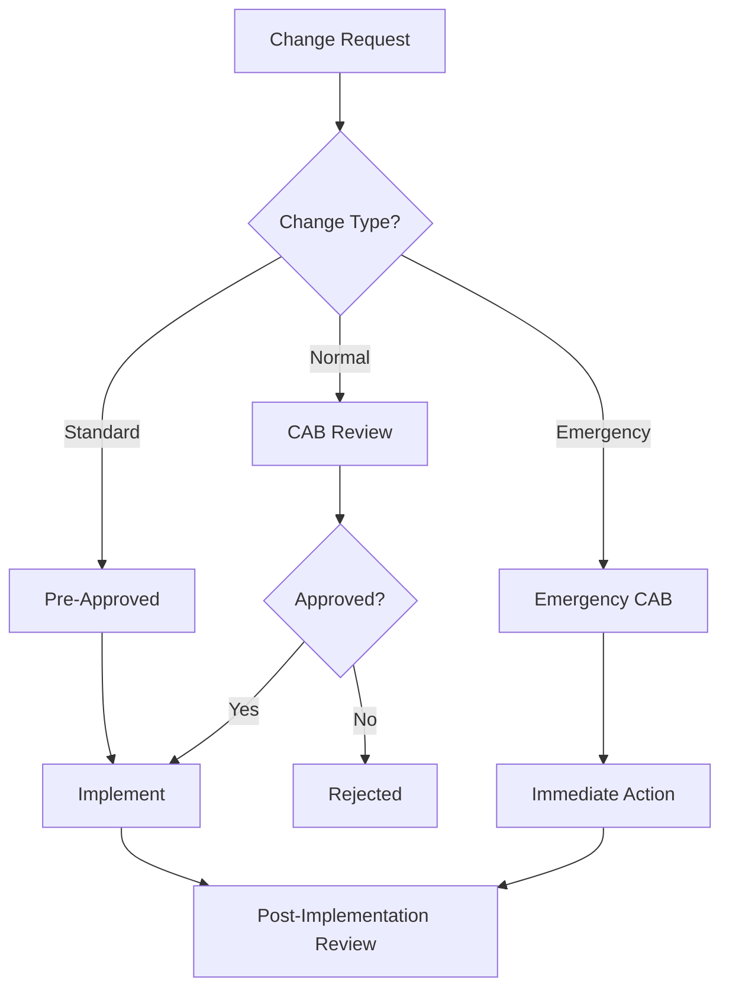

# Change Management (ITIL)

## What is ITIL Change Management?

**ITIL (Information Technology Infrastructure Library)** change management ensures that changes to IT services are implemented in a controlled manner, minimizing risk to service delivery.

### Goals
- **Minimize disruption** to business operations
- **Reduce change-related incidents** (failed deployments, outages)
- **Enable faster releases** through standardized processes
- **Track all changes** for compliance and audit

## Change Types



### 1. Standard Change
**Pre-authorized, low-risk, repeatable**

**Examples**:
- Password resets
- Software upgrades (approved versions)
- Routine server patching
- Adding users to groups

**Process**:
- No CAB approval needed (pre-approved)
- Follow documented procedure
- Log in ITSM tool (ServiceNow, Jira)

**Approval Time**: Immediate

### 2. Normal Change
**Higher risk, requires CAB approval**

**Examples**:
- New feature deployments
- Database schema changes
- Infrastructure upgrades
- Configuration changes

**Process**:
1. Submit RFC (Request for Change)
2. CAB reviews and approves
3. Schedule implementation
4. Implement with rollback plan
5. Post-implementation review

**Approval Time**: 3-7 days

### 3. Emergency Change
**Urgent, bypasses normal CAB**

**Examples**:
- Production outages
- Security vulnerabilities (zero-day exploits)
- Data corruption fixes
- Critical bug fixes

**Process**:
1. Emergency CAB (ECAB) convened
2. Fast-track approval (1-4 hours)
3. Immediate implementation
4. Post-implementation CAB review

**Approval Time**: < 4 hours

## RFC (Request for Change) Template

### Basic Information
| Field | Example |
|-------|---------|
| **Change ID** | CHG0001234 |
| **Title** | Deploy Payment Service v2.3 |
| **Requestor** | Jane Doe (Engineering Lead) |
| **Change Type** | Normal |
| **Priority** | Medium |
| **Risk Level** | Medium |

### Implementation Details
| Field | Example |
|-------|---------|
| **Start Time** | 2025-10-15, 2:00 AM EST |
| **End Time** | 2025-10-15, 4:00 AM EST |
| **Duration** | 2 hours |
| **Affected Systems** | Payment API, Database (PG-PROD-01) |
| **Expected Downtime** | None (blue-green deployment) |

### Description
```
Deploy Payment Service v2.3 which adds support for Apple Pay.
Includes database migration to add payment_method column.
Tested in staging with 10k synthetic transactions.
```

### Rollback Plan
```bash
# Kubernetes rollback (< 5 minutes)
kubectl rollout undo deployment/payment-service

# Database rollback (if needed)
# Migration is backward-compatible, no DB rollback needed
```

### Testing Evidence
- ✅ Unit tests (95% coverage)
- ✅ Integration tests (all passed)
- ✅ Staging deployment (2 weeks, no issues)
- ✅ Load testing (1000 req/sec sustained)
- ✅ Security scan (Snyk, no critical issues)

### Impact Assessment
- **Users affected**: None (backward-compatible)
- **Dependencies**: None
- **Business impact**: Enables Apple Pay for 30% of users

## CAB (Change Advisory Board)

### CAB Composition
- **Chair**: IT Service Manager
- **Members**:
  - Engineering Lead
  - QA Manager
  - Security Engineer
  - SRE/DevOps Lead
  - Business Representative

### CAB Meeting Agenda
1. **Review RFCs** (15 min per change)
2. **Assess risk** using Risk Matrix
3. **Check dependencies** (other changes, infrastructure)
4. **Verify testing** and rollback plans
5. **Vote**: Approve, Reject, or Defer

### CAB Meeting Frequency
- **Weekly**: For normal changes
- **Daily**: During high-activity periods (Black Friday)
- **Ad-hoc**: For emergency changes

## Risk Assessment Matrix

| Impact / Likelihood | Low | Medium | High |
|---------------------|-----|--------|------|
| **Low Impact** | ✅ Low Risk | ⚠️ Medium Risk | ⚠️ Medium Risk |
| **Medium Impact** | ⚠️ Medium Risk | ⚠️ Medium Risk | 🚨 High Risk |
| **High Impact** | ⚠️ Medium Risk | 🚨 High Risk | 🚨 High Risk |

### Risk Factors
- **Complexity**: How many systems affected?
- **Testing coverage**: Were all scenarios tested?
- **Rollback time**: How fast can we revert?
- **Business impact**: Revenue, customer trust, compliance
- **Timing**: Deploying during peak hours?

### Mitigation Strategies
- **Phased rollout**: Deploy to 5% → 25% → 100%
- **Feature flags**: Enable new feature gradually
- **Backup**: Always backup databases before schema changes
- **Monitoring**: Set up alerts for error rates, latency
- **Communication**: Notify stakeholders before, during, after

## Change Calendar

### Purpose
- **Visualize all changes** scheduled for next 30 days
- **Identify conflicts** (overlapping deployments)
- **Freeze windows** (Black Friday, year-end)
- **Capacity planning** (on-call engineer availability)

### Example Change Calendar

| Date | Time | Change | Risk | Owner | Status |
|------|------|--------|------|-------|--------|
| Oct 10 | 2 AM | Database upgrade | High | SRE Team | Approved |
| Oct 12 | 10 AM | API v2 release | Medium | Backend | Approved |
| Oct 15 | 2 AM | Payment service | Medium | Payments | Approved |
| Oct 20 | N/A | **FREEZE** (Marketing event) | - | - | - |
| Oct 25 | 3 AM | Frontend deploy | Low | Frontend | Pending |

### Freeze Windows
**No deployments allowed during**:
- **Black Friday / Cyber Monday**
- **End-of-quarter financial close**
- **Major product launches**
- **Peak business hours** (unless emergency)

## Post-Implementation Review (PIR)

### Purpose
- Verify change was successful
- Document lessons learned
- Update runbooks

### PIR Template

#### Change Summary
- **Change ID**: CHG0001234
- **Implemented**: 2025-10-15, 2:00 AM
- **Duration**: 1 hour 45 minutes (15 min under estimate)

#### Success Criteria
- ✅ Deployment completed successfully
- ✅ Smoke tests passed
- ✅ No increase in error rates
- ✅ Latency within normal range

#### Issues Encountered
- Minor: Database migration took 10 min longer than expected
- Resolution: Increased worker threads for future migrations

#### Lessons Learned
- Need better pre-deployment checklist
- Add database migration time buffer (+30%)
- Automate smoke test execution

#### Recommendations
- Update runbook with actual migration time
- Add monitoring alert for migration failures

## Compliance & Audit

### Why Track Changes?
- **SOX compliance** (Sarbanes-Oxley)
- **HIPAA** (healthcare data)
- **PCI-DSS** (payment card data)
- **ISO 27001** (information security)

### Audit Requirements
- **Change log**: All changes must be logged
- **Approval evidence**: CAB meeting minutes, email approvals
- **Testing evidence**: Test reports, staging logs
- **Rollback capability**: Documented and tested
- **Segregation of duties**: Requestor ≠ Approver ≠ Implementer

### ServiceNow Change Management
```javascript
// Example: Query changes for audit
const changes = new GlideRecord('change_request');
changes.addQuery('state', 'Closed');
changes.addQuery('closed_at', '>=', '2025-01-01');
changes.query();

while (changes.next()) {
  // Export change ID, requestor, approver, implementation date
  gs.log(changes.number + ': ' + changes.short_description);
}
```

## Best Practices

### 1. Automate Standard Changes
```yaml
# Example: Ansible playbook for standard change (add user)
- name: Add user to AD group
  hosts: domain_controller
  tasks:
    - name: Add user to group
      win_domain_group_membership:
        name: "AppUsers"
        members: "{{ new_user }}"
        state: present
```

### 2. Use Feature Flags
```javascript
// Gradual rollout without deployment
if (featureFlags.isEnabled('apple_pay', userId)) {
  showApplePayButton();
}
```

### 3. Implement Change Metrics

| Metric | Target | Tracking |
|--------|--------|----------|
| **Change success rate** | > 95% | (Successful / Total) × 100 |
| **Emergency change %** | < 10% | (Emergency / Total) × 100 |
| **Mean time to approve** | < 3 days | Date submitted → Date approved |
| **Change-related incidents** | < 5% | Incidents caused by changes |

### 4. Continuous Improvement
- **Monthly CAB retrospective**: What went well? What didn't?
- **Simplify RFC process**: Reduce form fields, automate approvals
- **Faster feedback loops**: Automated testing, observability

## FAQs

**Q: Do we need CAB approval for every deployment?**  
A: No. Standard changes (pre-approved) skip CAB. Focus CAB on higher-risk changes.

**Q: How do we handle urgent bug fixes?**  
A: Use Emergency Change process with ECAB approval (can be email/Slack).

**Q: Can we deploy without CAB approval in an emergency?**  
A: Yes, but must document decision and get post-implementation CAB review.

**Q: How long should we keep change records?**  
A: Minimum 7 years for compliance (SOX, HIPAA). Check your industry requirements.

**Q: What if business wants faster releases?**  
A: Shift more changes to "Standard" (pre-approved), automate testing, use feature flags.

## Further Reading

- [ITIL 4 Foundation](https://www.axelos.com/certifications/itil-service-management/itil-4-foundation)
- [ServiceNow Change Management](https://www.servicenow.com/products/it-service-management/what-is-change-management.html)
- [Atlassian ITSM Guide](https://www.atlassian.com/itsm/change-management)
