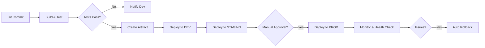

# CI/CD Pipeline — From Commit to Release

## What You'll Learn
- How CI/CD automates software delivery from commit to production
- The stages of a modern pipeline: build, test, artifact, and deploy
- Deployment strategies: blue-green and canary releases
- Rollback procedures and health check automation
- Best practices for pipeline performance and security

## Overview

A **CI/CD pipeline** automates the software delivery process, enabling teams to release features faster while maintaining quality. **Continuous Integration (CI)** merges code frequently and runs automated tests to catch issues early. **Continuous Deployment (CD)** automatically releases tested code to production environments.

**Why it matters**: Manual deployments are error-prone, slow, and don't scale. Automated pipelines reduce deployment time from hours to minutes, catch bugs before production, and enable teams to ship multiple times per day with confidence.

## Architecture / Flow



## Pipeline Stages

### 1. Source Control & Trigger
Developer commits code to Git → Pipeline automatically triggers based on branch rules (e.g., push to `main` or PR merge).

### 2. Build & Compile
- Compile source code
- Package dependencies
- Create artifacts (JAR, Docker image, ZIP)
- Fail fast if build errors occur

### 3. Automated Testing
- **Unit tests**: Individual function/module tests
- **Integration tests**: Component interaction tests
- **E2E tests**: Full workflow validation
- **Security scans**: SAST (SonarQube), dependency checks (Snyk)

### 4. Artifact Storage
Store versioned artifacts in registries:
- **Docker images** → Docker Hub, ECR, ACR
- **Packages** → Artifactory, Nexus
- **Binaries** → S3, Azure Blob

### 5. Deployment Stages


#### DEV Environment
- Auto-deploy on every merge
- Used for developer testing
- No approval gates

#### STAGING Environment
- Mirror of production
- Smoke tests & UAT
- Optional approval gate

#### PRODUCTION Environment
- Manual approval required
- Blue-green or canary deployment
- Automated health checks
- Instant rollback capability

## Rollback Strategies

### Blue-Green Deployment
```yaml
# Two identical environments
Blue (old version) ← 100% traffic
Green (new version) ← deploy + test
Switch traffic: Blue → Green
Keep Blue ready for instant rollback
```

### Canary Deployment
```yaml
# Gradual traffic shift
Phase 1: 5% traffic to new version
Phase 2: 25% traffic (monitor metrics)
Phase 3: 50% traffic
Phase 4: 100% traffic
Rollback at any phase if errors detected
```

### Rollback Checklist
- [ ] Identify failing release version
- [ ] Trigger rollback (via pipeline or kubectl)
- [ ] Verify previous version is deployed
- [ ] Run smoke tests
- [ ] Check application logs
- [ ] Notify stakeholders
- [ ] Create incident postmortem

## Common Pipeline Tools

| Tool | Use Case |
|------|----------|
| **GitHub Actions** | Git-native CI/CD, matrix builds |
| **Jenkins** | Enterprise CI/CD, plugin ecosystem |
| **GitLab CI** | Integrated DevOps platform |
| **Azure Pipelines** | Azure-native, YAML/Classic |
| **CircleCI** | Fast builds, Docker support |
| **ArgoCD** | GitOps for Kubernetes |

## Best Practices

1. **Fail Fast**: Run quick tests first (linting, unit tests)
2. **Parallel Execution**: Run independent stages concurrently
3. **Immutable Artifacts**: Never rebuild artifacts between stages
4. **Environment Parity**: Keep DEV/STAGING/PROD configs similar
5. **Monitoring**: Track DORA metrics (deployment frequency, lead time, MTTR, change failure rate)
6. **Security**: Scan secrets, dependencies, container images
7. **Documentation**: Maintain runbooks for rollbacks and incident response

## Example: GitHub Actions CI/CD

```yaml
name: CI/CD Pipeline
on:
  push:
    branches: [main]

jobs:
  build-and-deploy:
    runs-on: ubuntu-latest
    steps:
      - uses: actions/checkout@v4
      
      - name: Build Docker Image
        run: docker build -t myapp:${{ github.sha }} .
      
      - name: Run Tests
        run: docker run myapp:${{ github.sha }} npm test
      
      - name: Push to Registry
        run: |
          docker tag myapp:${{ github.sha }} registry/myapp:latest
          docker push registry/myapp:latest
      
      - name: Deploy to Kubernetes
        run: |
          kubectl set image deployment/myapp myapp=registry/myapp:latest
          kubectl rollout status deployment/myapp
```

## FAQs

**Q: How often should we deploy?**  
A: Best teams deploy multiple times per day. Start with weekly, then iterate towards daily deployments.

**Q: Should every commit trigger a full pipeline?**  
A: Run CI (build + test) on every commit. CD (deploy) on main branch only.

**Q: How do we handle database migrations?**  
A: Use versioned migration tools (Flyway, Liquibase), run migrations before app deployment, always make migrations backward-compatible.

**Q: What if tests fail in production?**  
A: Automated health checks should trigger instant rollback. Monitor error rates, latency, and business metrics.

## Further Reading

- [GitHub Actions Documentation](https://docs.github.com/actions)
- [Continuous Delivery by Jez Humble](https://continuousdelivery.com/)
- [DORA Metrics](https://cloud.google.com/blog/products/devops-sre/using-the-four-keys-to-measure-your-devops-performance)
