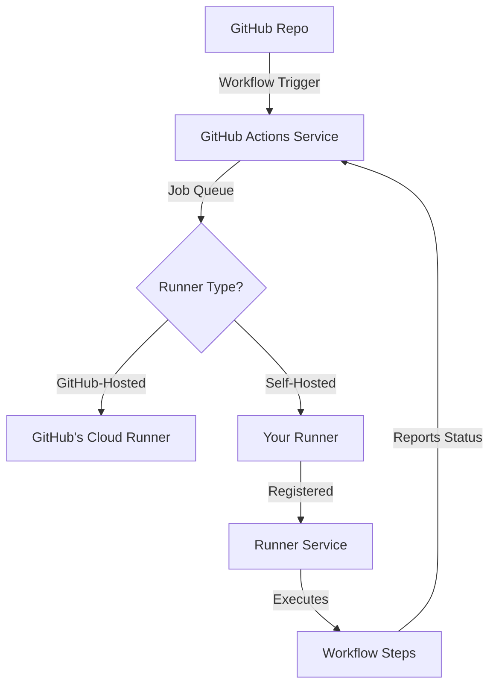

# GitHub Actions — Self-Hosted Runners

## Why Self-Hosted Runners?

**GitHub-hosted runners** are convenient but have limitations:
- ❌ Limited build minutes (2,000/month free tier)
- ❌ No access to private networks or databases
- ❌ Fixed hardware specs (2-core CPU, 7GB RAM)
- ❌ Cannot cache large dependencies (Docker layers, npm modules)

**Self-hosted runners** give you:
- ✅ Unlimited build minutes
- ✅ Access to private VPCs, databases, and internal APIs
- ✅ Custom hardware (GPU, large RAM, NVMe storage)
- ✅ Pre-installed dependencies (Docker, Kubernetes CLI, custom tools)
- ✅ Cost savings for large teams

## Runner Architecture



## Setting Up a Self-Hosted Runner

### 1. Install Runner (Linux)

```bash
# Create runner directory
mkdir actions-runner && cd actions-runner

# Download runner package
curl -o actions-runner-linux-x64-2.311.0.tar.gz -L \
  https://github.com/actions/runner/releases/download/v2.311.0/actions-runner-linux-x64-2.311.0.tar.gz

# Extract
tar xzf ./actions-runner-linux-x64-2.311.0.tar.gz

# Configure runner (get token from GitHub repo Settings → Actions → Runners)
./config.sh --url https://github.com/YOUR_ORG/YOUR_REPO --token YOUR_TOKEN

# Install as service
sudo ./svc.sh install
sudo ./svc.sh start
```

### 2. Runner Labels & Targeting

```yaml
# .github/workflows/build.yml
name: Build on Self-Hosted Runner
on: push

jobs:
  build:
    runs-on: self-hosted  # Uses any self-hosted runner
    # OR target specific labels:
    # runs-on: [self-hosted, linux, x64, gpu]
    
    steps:
      - uses: actions/checkout@v4
      - name: Build with Docker
        run: docker build -t myapp .
```

### 3. Security Best Practices

**⚠️ Critical Security Considerations**

- **Never use self-hosted runners for public repos** (malicious PRs can execute arbitrary code)
- **Isolate runners** in separate VMs/containers
- **Limit runner permissions** (use least-privilege service accounts)
- **Rotate tokens** regularly
- **Monitor runner logs** for suspicious activity
- **Use ephemeral runners** (auto-delete after each job)

### Ephemeral Runner Setup

```bash
# Run once per job (recommended for security)
./config.sh --url https://github.com/ORG/REPO --token TOKEN --ephemeral
./run.sh
```

## Runner Scaling Strategies

### Manual Scaling
```bash
# Start multiple runners on same host (with unique names)
./config.sh --name runner-1 --url ...
./config.sh --name runner-2 --url ...
./config.sh --name runner-3 --url ...
```

### Auto-Scaling with Kubernetes

```yaml
# actions-runner-controller (ARC)
apiVersion: actions.summerwind.dev/v1alpha1
kind: RunnerDeployment
metadata:
  name: github-runner
spec:
  replicas: 5  # Number of runners
  template:
    spec:
      repository: YOUR_ORG/YOUR_REPO
      labels:
        - self-hosted
        - k8s
      dockerdWithinRunnerContainer: true
```

### Auto-Scaling with AWS (Philips Labs Runner)

```hcl
# Terraform setup for AWS auto-scaling
module "runners" {
  source  = "philips-labs/github-runner/aws"
  
  aws_region = "us-east-1"
  vpc_id     = "vpc-123456"
  subnet_ids = ["subnet-123", "subnet-456"]
  
  github_app = {
    id         = "12345"
    key_base64 = "base64_encoded_private_key"
  }
  
  runner_extra_labels = ["aws", "x64"]
  scale_down_schedule_expression = "cron(0 20 * * ? *)"  # Scale down at 8pm
}
```

## Common Use Cases

### Use Case 1: Private Database Access

```yaml
jobs:
  test-with-db:
    runs-on: self-hosted  # Has VPC access
    steps:
      - uses: actions/checkout@v4
      - name: Run Integration Tests
        env:
          DB_HOST: internal-postgres.vpc.local
        run: npm run test:integration
```

### Use Case 2: GPU-Accelerated Builds

```yaml
jobs:
  train-model:
    runs-on: [self-hosted, gpu, cuda]
    steps:
      - uses: actions/checkout@v4
      - name: Train ML Model
        run: python train.py --gpu
```

### Use Case 3: Large Docker Cache

```yaml
jobs:
  build:
    runs-on: self-hosted  # Local Docker cache
    steps:
      - uses: actions/checkout@v4
      - name: Build with Cache
        run: |
          docker build --cache-from myapp:latest -t myapp:${{ github.sha }} .
          docker tag myapp:${{ github.sha }} myapp:latest
```

## Troubleshooting Checklist

- [ ] Runner appears in GitHub repo settings?
- [ ] Runner status shows "Idle" (ready for jobs)?
- [ ] Firewall allows outbound HTTPS (443) to github.com?
- [ ] Runner has correct labels configured?
- [ ] Workflow targets correct runner labels?
- [ ] Runner logs show recent activity? (`sudo journalctl -u actions.runner -f`)
- [ ] Disk space available? (Docker layers can fill disk)

## Monitoring & Maintenance

```bash
# Check runner status
sudo systemctl status actions.runner

# View runner logs
sudo journalctl -u actions.runner -f

# Update runner
cd ~/actions-runner
sudo ./svc.sh stop
./config.sh remove --token TOKEN
# Download new version, then reconfigure
sudo ./svc.sh install
sudo ./svc.sh start

# Clean up Docker space (run weekly)
docker system prune -af --volumes
```

## Cost Comparison

| Metric | GitHub-Hosted | Self-Hosted (t3.large) |
|--------|---------------|------------------------|
| **Cost/month** | $0.008/min (after free tier) | ~$60/month (EC2) |
| **Build minutes** | 2,000 free | Unlimited |
| **Break-even** | ~125 hours | Always cheaper for heavy usage |
| **Hardware** | 2 CPU, 7GB RAM | 2 CPU, 8GB RAM (customizable) |

## FAQs

**Q: Can I use self-hosted runners for open-source projects?**  
A: **No**, it's a security risk. Use GitHub-hosted runners for public repos.

**Q: How many jobs can one runner handle?**  
A: One job at a time per runner. Scale horizontally by adding more runners.

**Q: Can I run Windows/macOS runners?**  
A: Yes, GitHub provides runner binaries for Windows, macOS, and Linux.

**Q: How do I remove a runner?**  
A: `./config.sh remove --token YOUR_TOKEN` (get token from GitHub settings).

## Further Reading

- [GitHub Self-Hosted Runners Docs](https://docs.github.com/actions/hosting-your-own-runners)
- [Actions Runner Controller (K8s)](https://github.com/actions/actions-runner-controller)
- [Philips Labs AWS Runner](https://github.com/philips-labs/terraform-aws-github-runner)
