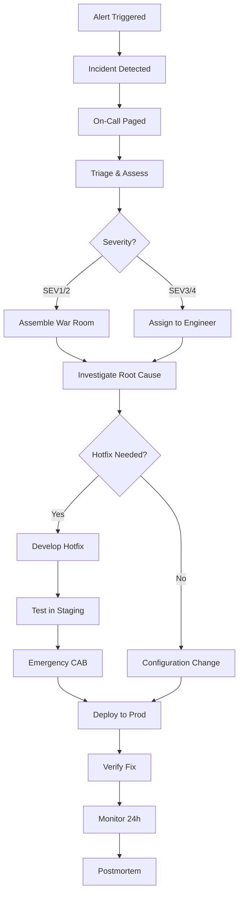

# Incident → Hotfix Flow

## Incident Lifecycle



## Severity Levels

### SEV1 — Critical (All Hands)
**Impact**: Complete service outage, data loss, security breach

**Examples**:
- Website down (500 errors)
- Payment processing broken
- Database corruption
- DDoS attack

**Response Time**: < 15 minutes  
**Resolution Time**: < 1 hour  
**Communication**: Every 30 minutes (status page, exec team, customers)

### SEV2 — High (Major Functionality)
**Impact**: Core feature broken, affects majority of users

**Examples**:
- Login broken for 50% of users
- Search results not loading
- API timeout issues (>30% error rate)

**Response Time**: < 30 minutes  
**Resolution Time**: < 4 hours  
**Communication**: Every hour (internal stakeholders)

### SEV3 — Medium (Partial Functionality)
**Impact**: Minor feature broken, workaround available

**Examples**:
- CSV export failing
- Notification emails delayed
- Dashboard charts not rendering

**Response Time**: < 2 hours  
**Resolution Time**: < 24 hours  
**Communication**: Daily updates

### SEV4 — Low (Cosmetic)
**Impact**: Visual bug, no functional impact

**Examples**:
- Button alignment issue
- Typo in UI text
- Missing icon

**Response Time**: < 8 hours (next business day)  
**Resolution Time**: Next release cycle

## Incident Response Checklist

### Immediate Response (0-15 min)

- [ ] **Acknowledge alert** (PagerDuty, Opsgenie)
- [ ] **Check status page** (is this already known?)
- [ ] **Verify incident** (can you reproduce it?)
- [ ] **Declare severity** (SEV1 / SEV2 / SEV3 / SEV4)
- [ ] **Create incident ticket** (Jira, ServiceNow)
- [ ] **Post in #incidents Slack channel**

### Triage (15-30 min)

- [ ] **Gather evidence**:
  - Recent deployments? (last 24 hours)
  - Traffic spike? (check CloudWatch, Grafana)
  - Error logs? (ELK, Splunk)
  - Third-party service down? (AWS Status, GitHub Status)
- [ ] **Assess scope**:
  - How many users affected?
  - Which regions/services?
- [ ] **Identify incident commander** (for SEV1/2)

### Investigation (30-60 min)

- [ ] **Check common culprits**:
  - Recent code deploy? → Rollback first
  - Database issue? → Check connections, slow queries
  - Infra change? → Review Terraform/CloudFormation changes
  - Third-party API? → Check status pages
- [ ] **Enable debug logging** (if safe)
- [ ] **Collect metrics** (before/after graphs)

### Remediation (1-4 hours)

- [ ] **Implement temporary fix** (restart, scale up, disable feature)
- [ ] **Develop hotfix** (if needed)
- [ ] **Test hotfix in staging**
- [ ] **Get emergency CAB approval** (5-minute review)
- [ ] **Deploy hotfix**
- [ ] **Verify fix** (smoke tests, monitor metrics)

### Resolution (4-24 hours)

- [ ] **Monitor for 24 hours** (ensure no regression)
- [ ] **Close incident ticket**
- [ ] **Update status page** ("Incident resolved")
- [ ] **Schedule postmortem** (within 48 hours)

## Hotfix Development Workflow

### 1. Create Hotfix Branch

```bash
# Branch from production tag (not main)
git checkout -b hotfix/payment-processing-fix v2.5.3

# Make minimal fix (do NOT refactor or add features)
# Edit only the necessary files

git commit -m "fix: resolve payment API timeout issue"
```

### 2. Test in Staging

```bash
# Deploy to staging environment
kubectl set image deployment/payment-service \
  payment-service=registry/payment-service:hotfix-123

# Run smoke tests
./scripts/smoke-test.sh staging

# Check logs for errors
kubectl logs -f deployment/payment-service | grep ERROR
```

### 3. Emergency CAB Approval

**Quick RFC** (5-minute review):
- **What broke?** Payment API timeouts
- **Root cause?** Database connection pool exhausted
- **Fix?** Increased pool size from 10 → 50
- **Rollback?** kubectl rollout undo
- **Risk?** Low (tested in staging, 1-line config change)

**Approval**: Email/Slack from incident commander + 1 senior engineer

### 4. Deploy to Production

```bash
# Blue-green deployment (no downtime)
# Deploy to "green" environment first
kubectl apply -f k8s/production/payment-service-green.yaml

# Run smoke test on green
curl https://green.payment.myapp.com/health

# Switch traffic to green
kubectl patch service payment-service -p '{"spec":{"selector":{"version":"green"}}}'

# Monitor for 15 minutes
# If issues, switch back to blue instantly
```

### 5. Post-Deployment Verification

```bash
# Check error rate (should drop to < 1%)
curl https://prometheus.myapp.com/api/v1/query?query=http_errors_total

# Check latency (p95 should be < 200ms)
curl https://prometheus.myapp.com/api/v1/query?query=http_request_duration_p95

# Check transaction volume (back to baseline?)
SELECT COUNT(*) FROM payments WHERE created_at > NOW() - INTERVAL '1 hour';
```

## Communication Templates

### Incident Notification (SEV1)

```
🚨 **INCIDENT DECLARED** — SEV1

**Impact**: Payment processing down for all users
**Detected**: 2025-10-15 14:32 UTC
**Incident Commander**: @jane-doe
**Status**: Investigating

**Next Update**: 15:00 UTC (30 min)
**Status Page**: https://status.myapp.com
**War Room**: Zoom link
```

### Hotfix Deployed

```
✅ **HOTFIX DEPLOYED** — CHG0005678

**Incident**: INC0003456 (Payment processing down)
**Fix**: Increased DB connection pool (10 → 50)
**Deployed**: 2025-10-15 15:15 UTC
**Monitoring**: Active (next 24 hours)

**Impact**: Payment processing restored, monitoring for stability
**Next Steps**: Postmortem scheduled for Oct 17
```

### Resolution Announcement

```
✅ **INCIDENT RESOLVED** — INC0003456

**Duration**: 43 minutes (14:32 - 15:15 UTC)
**Root Cause**: Database connection pool exhausted
**Fix**: Scaled connection pool + added monitoring
**Prevention**: Implementing auto-scaling for DB connections

**Postmortem**: Will be published by Oct 17
Thank you for your patience!
```

## Postmortem Template

### Incident Summary
- **Incident ID**: INC0003456
- **Date**: 2025-10-15
- **Duration**: 43 minutes
- **Severity**: SEV1
- **Services Affected**: Payment API, Checkout

### Impact
- **Users Affected**: ~50,000 (all users in US region)
- **Revenue Lost**: ~$25,000 (estimated)
- **Customer Complaints**: 234 (support tickets + social media)

### Timeline

| Time (UTC) | Event |
|------------|-------|
| 14:32 | Alert triggered (error rate spike) |
| 14:35 | On-call engineer paged |
| 14:40 | Incident confirmed, SEV1 declared |
| 14:45 | War room assembled, investigating |
| 15:00 | Root cause identified (DB pool exhausted) |
| 15:05 | Hotfix developed and tested in staging |
| 15:10 | Emergency CAB approval obtained |
| 15:15 | Hotfix deployed to production |
| 15:20 | Verified fix, error rate normalized |

### Root Cause
Database connection pool size (10) was too small for traffic load (1000 req/sec). When all connections were in use, new requests timed out.

### What Went Well
- ✅ Fast detection (3 minutes after issue started)
- ✅ Clear incident process (everyone knew their role)
- ✅ Quick rollout of hotfix (35 minutes from detection to fix)

### What Went Wrong
- ❌ No monitoring alert for DB connection pool usage
- ❌ Load testing didn't simulate production traffic patterns
- ❌ No auto-scaling for DB connections

### Action Items

| Action | Owner | Due Date | Status |
|--------|-------|----------|--------|
| Add DB pool usage alert (> 80% = warning) | @sre-team | Oct 20 | ✅ Done |
| Implement auto-scaling for DB pool | @backend-team | Oct 25 | 🔄 In Progress |
| Update load testing to match prod traffic | @qa-team | Nov 1 | 📋 Planned |
| Document hotfix process in runbook | @devops-team | Oct 18 | ✅ Done |

## Preventing Future Incidents

### 1. Monitoring & Alerting

```yaml
# Prometheus alert example
- alert: HighErrorRate
  expr: rate(http_requests_total{status=~"5.."}[5m]) > 0.05
  for: 2m
  labels:
    severity: critical
  annotations:
    summary: "High error rate detected (> 5%)"
```

### 2. Circuit Breakers

```python
# Python circuit breaker example
from circuitbreaker import circuit

@circuit(failure_threshold=5, recovery_timeout=60)
def call_payment_api():
    response = requests.post("https://api.stripe.com/charges")
    response.raise_for_status()
    return response.json()
```

### 3. Feature Flags (Kill Switches)

```javascript
// Disable broken feature instantly (no deploy)
if (!featureFlags.isEnabled('payment_v2')) {
  return legacyPaymentFlow();  // Fallback to old version
}
```

### 4. Runbooks

Document common incidents:
- **Database connection errors** → Increase pool size
- **API timeouts** → Check rate limits, scale up
- **Memory leaks** → Restart pods, investigate code

## FAQs

**Q: Should we always rollback on incidents?**  
A: If recent deploy is suspected, yes. Rollback first, investigate later.

**Q: Who decides if a hotfix is needed?**  
A: Incident commander (for SEV1/2) or on-call engineer (for SEV3/4).

**Q: Can we skip testing for critical hotfixes?**  
A: Minimize testing (5-10 min smoke test), but never deploy untested code.

**Q: How do we avoid blame during postmortems?**  
A: Focus on process, not people. Use "blameless postmortem" framework.

## Further Reading

- [Google SRE Book — Incident Response](https://sre.google/sre-book/effective-troubleshooting/)
- [Atlassian Incident Management](https://www.atlassian.com/incident-management)
- [PagerDuty Incident Response Guide](https://response.pagerduty.com/)
