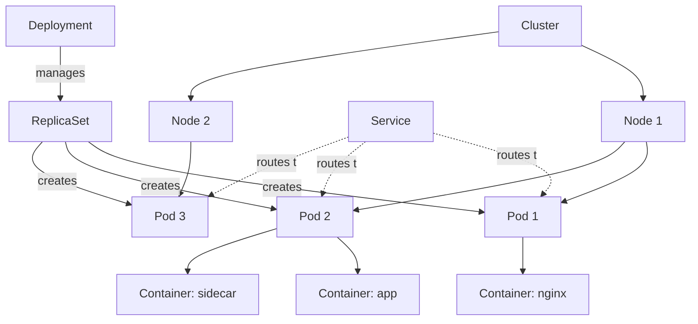

# Kubernetes 101 — Pods, Deployments, Services

## What is Kubernetes?

**Kubernetes (K8s)** orchestrates containerized applications at scale. It automates:
- **Deployment**: Roll out updates without downtime
- **Scaling**: Automatically add/remove container instances
- **Self-healing**: Restart failed containers, reschedule on healthy nodes
- **Load balancing**: Distribute traffic across containers
- **Secret management**: Securely store credentials

## Core Concepts



### Pod
**Smallest deployable unit** in Kubernetes. Contains one or more containers that share:
- Network namespace (same IP address)
- Storage volumes
- Lifecycle (created/deleted together)

**Best practice**: One container per Pod (unless sidecar pattern needed).

### Deployment
**Manages Pods declaratively**. Features:
- **Desired state**: "I want 3 replicas of nginx"
- **Rolling updates**: Replace Pods one-by-one (zero downtime)
- **Rollback**: Revert to previous version instantly
- **Self-healing**: Recreate Pods if they crash

Deployment → creates → ReplicaSet → creates → Pods

### Service
**Stable network endpoint** for Pods. Provides:
- **Load balancing**: Distributes traffic across healthy Pods
- **Service discovery**: Access Pods via DNS name (e.g., `myapp-service.default.svc.cluster.local`)
- **Stable IP**: Pods are ephemeral (IPs change), Services are stable

Service types:
- **ClusterIP** (default): Internal-only access
- **NodePort**: Exposes on every Node's IP at a static port
- **LoadBalancer**: Provisions cloud load balancer (AWS ELB, Azure LB)

## Example: Deploy nginx

### Step 1: Create Deployment

```yaml
apiVersion: apps/v1
kind: Deployment
metadata:
  name: nginx-deployment
  labels:
    app: nginx
spec:
  replicas: 3  # Run 3 Pods
  selector:
    matchLabels:
      app: nginx  # Target Pods with this label
  template:
    metadata:
      labels:
        app: nginx
    spec:
      containers:
      - name: nginx
        image: nginx:1.21
        ports:
        - containerPort: 80
        resources:
          requests:
            cpu: 100m
            memory: 128Mi
          limits:
            cpu: 200m
            memory: 256Mi
```

Apply it:
```bash
kubectl apply -f deployment.yaml
```

### Step 2: Verify Deployment

```bash
# Check deployment status
kubectl get deployments

# List Pods
kubectl get pods -l app=nginx

# View Pod details
kubectl describe pod nginx-deployment-<pod-id>

# Check logs
kubectl logs nginx-deployment-<pod-id>
```

### Step 3: Create Service

```yaml
apiVersion: v1
kind: Service
metadata:
  name: nginx-service
spec:
  type: LoadBalancer  # Creates cloud load balancer
  selector:
    app: nginx  # Route to Pods with this label
  ports:
  - protocol: TCP
    port: 80        # External port
    targetPort: 80  # Pod port
```

Apply it:
```bash
kubectl apply -f service.yaml

# Get external IP (may take 1-2 minutes)
kubectl get service nginx-service
```

### Step 4: Test

```bash
# Get service URL
EXTERNAL_IP=$(kubectl get service nginx-service -o jsonpath='{.status.loadBalancer.ingress[0].ip}')

# Test
curl http://$EXTERNAL_IP
```

## Scaling & Updates

### Manual Scaling

```bash
# Scale to 5 replicas
kubectl scale deployment nginx-deployment --replicas=5

# Verify
kubectl get pods -l app=nginx
```

### Auto-Scaling (HPA)

```yaml
apiVersion: autoscaling/v2
kind: HorizontalPodAutoscaler
metadata:
  name: nginx-hpa
spec:
  scaleTargetRef:
    apiVersion: apps/v1
    kind: Deployment
    name: nginx-deployment
  minReplicas: 3
  maxReplicas: 10
  metrics:
  - type: Resource
    resource:
      name: cpu
      target:
        type: Utilization
        averageUtilization: 70  # Scale up when CPU > 70%
```

### Rolling Updates

```bash
# Update image
kubectl set image deployment/nginx-deployment nginx=nginx:1.22

# Watch rollout
kubectl rollout status deployment/nginx-deployment

# Check history
kubectl rollout history deployment/nginx-deployment
```

### Rollback

```bash
# Rollback to previous version
kubectl rollout undo deployment/nginx-deployment

# Rollback to specific revision
kubectl rollout undo deployment/nginx-deployment --to-revision=2
```

## Troubleshooting Checklist

- [ ] Pods running? `kubectl get pods`
- [ ] Check Pod events: `kubectl describe pod <pod-name>`
- [ ] View logs: `kubectl logs <pod-name>`
- [ ] Check resource usage: `kubectl top pods`
- [ ] Verify Service selector matches Pod labels
- [ ] Test DNS: `kubectl run -it --rm debug --image=busybox --restart=Never -- nslookup nginx-service`
- [ ] Check network policies: `kubectl get networkpolicies`

## Common Issues

### Pods Stuck in "Pending"
**Cause**: Insufficient CPU/memory on nodes  
**Fix**: Scale cluster or reduce resource requests

### Pods in "CrashLoopBackOff"
**Cause**: Container exits immediately  
**Fix**: Check logs (`kubectl logs <pod>`) and fix application code

### Service Not Reachable
**Cause**: Selector mismatch or firewall rules  
**Fix**: Verify Service selector matches Pod labels

### ImagePullBackOff
**Cause**: Invalid image name or private registry auth missing  
**Fix**: Check image name, add imagePullSecrets if needed

## Essential kubectl Commands

```bash
# Get resources
kubectl get pods
kubectl get deployments
kubectl get services
kubectl get nodes

# Describe (detailed info)
kubectl describe pod <pod-name>

# Logs
kubectl logs <pod-name>
kubectl logs <pod-name> -f  # Follow logs

# Execute command in Pod
kubectl exec -it <pod-name> -- bash

# Port forward (local testing)
kubectl port-forward pod/<pod-name> 8080:80

# Delete resources
kubectl delete pod <pod-name>
kubectl delete deployment <deployment-name>

# Apply config
kubectl apply -f <file.yaml>

# View YAML of running resource
kubectl get deployment nginx-deployment -o yaml
```

## Best Practices

1. **Resource Limits**: Always set CPU/memory requests and limits
2. **Health Checks**: Define liveness and readiness probes
3. **Labels**: Use consistent labeling for organization
4. **Namespaces**: Isolate environments (dev, staging, prod)
5. **ConfigMaps/Secrets**: Externalize configuration
6. **Immutable Deployments**: Never edit Pods directly, update Deployment
7. **Monitoring**: Use Prometheus + Grafana for metrics

## FAQs

**Q: What's the difference between Pod and Deployment?**  
A: Pod is the container runtime. Deployment manages Pods (scaling, updates, rollbacks).

**Q: When should I use ClusterIP vs LoadBalancer?**  
A: ClusterIP for internal services. LoadBalancer for external access.

**Q: How do I connect to a database from a Pod?**  
A: Use Service for internal DB, or external name Service for cloud databases.

**Q: Can I run stateful apps (databases) in Kubernetes?**  
A: Yes, use StatefulSets for apps requiring stable network IDs and persistent storage.

## Further Reading

- [Kubernetes Official Docs](https://kubernetes.io/docs/home/)
- [Interactive K8s Tutorial](https://kubernetes.io/docs/tutorials/kubernetes-basics/)
- [kubectl Cheat Sheet](https://kubernetes.io/docs/reference/kubectl/cheatsheet/)
