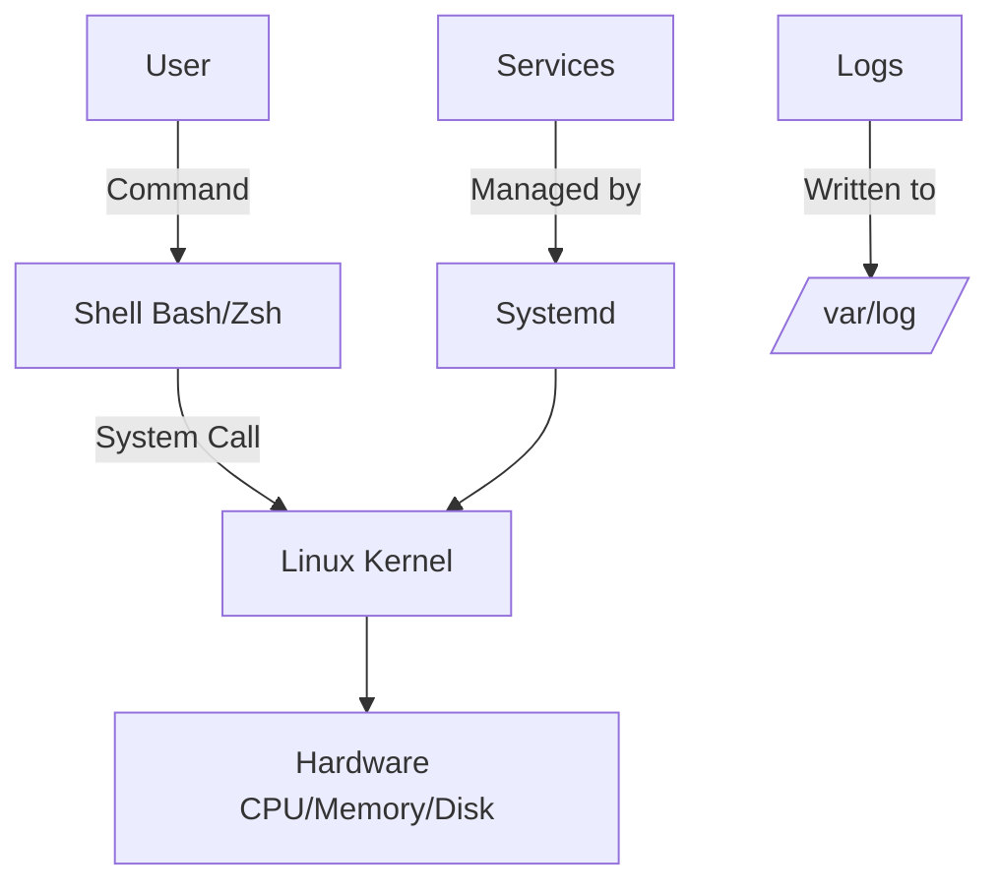

# Linux for DevOps Engineers

## What You'll Learn
- Essential Linux commands for file operations, process management, and networking
- Write powerful Bash scripts for automation
- Manage services with systemd
- Troubleshoot servers with logs and monitoring tools
- Secure servers with SSH, firewall, and user permissions
- Performance tuning and system optimization

## Overview

**Linux** powers 96.3% of the world's top 1 million web servers, making it the foundation of DevOps infrastructure. Mastering Linux is essential for server management, container orchestration (Docker/Kubernetes), CI/CD automation, and cloud operations.

**Why it matters**: DevOps engineers spend 70%+ of their time on Linux systems—deploying applications, debugging issues, automating tasks, and managing infrastructure. Without Linux proficiency, you're limited to GUI tools and can't troubleshoot production incidents effectively.

## Architecture / Flow



## Essential Commands

### File Operations

```bash
# List files (detailed, including hidden)
ls -lah

# Change directory
cd /var/log
cd ~  # Home directory
cd -  # Previous directory

# View file contents
cat nginx.log               # Entire file
head -n 20 nginx.log        # First 20 lines
tail -n 50 nginx.log        # Last 50 lines
tail -f nginx.log           # Follow (real-time updates)
less nginx.log              # Paginated view (press q to quit)

# Create/delete files and directories
touch file.txt
mkdir -p /app/data/logs     # Create nested directories
rm file.txt
rm -rf /app/old-data        # Remove directory recursively (DANGEROUS!)

# Copy and move
cp source.txt dest.txt
cp -r /app /backup/app      # Recursive copy
mv old-name.txt new-name.txt
mv file.txt /new/location/

# Search in files
grep "ERROR" application.log
grep -r "TODO" /app/src/    # Recursive search
grep -i "error" log.txt     # Case-insensitive
grep -v "INFO" log.txt      # Invert match (exclude INFO)

# Find files
find /var/log -name "*.log"
find /app -type f -mtime +30  # Files modified >30 days ago
find /tmp -size +100M         # Files larger than 100MB

# File permissions
chmod 755 script.sh           # rwxr-xr-x (owner: rwx, group: r-x, others: r-x)
chmod +x script.sh            # Add execute permission
chown user:group file.txt
chown -R user:group /app      # Recursive ownership change

# Disk usage
df -h                         # Disk space usage
du -sh /var/log/*             # Directory sizes
du -h --max-depth=1 /home     # Top-level directories only
```

### Process Management

```bash
# List processes
ps aux                        # All processes
ps aux | grep nginx           # Find specific process
top                           # Live process monitor (press q to quit)
htop                          # Enhanced top (install: sudo apt install htop)

# Kill processes
kill PID                      # Graceful termination (SIGTERM)
kill -9 PID                   # Force kill (SIGKILL)
killall nginx                 # Kill all nginx processes
pkill -f "java.*myapp"        # Kill by pattern

# Background processes
./long-running-script.sh &    # Run in background
jobs                          # List background jobs
fg %1                         # Bring job 1 to foreground
nohup ./script.sh &           # Keep running after logout
```

### System Services (Systemd)

```bash
# Service management
sudo systemctl start nginx
sudo systemctl stop nginx
sudo systemctl restart nginx
sudo systemctl reload nginx       # Reload config without restart
sudo systemctl enable nginx       # Start on boot
sudo systemctl disable nginx      # Don't start on boot

# Check service status
systemctl status nginx
systemctl is-active nginx
systemctl is-enabled nginx

# View service logs
journalctl -u nginx.service
journalctl -u nginx.service -f    # Follow logs
journalctl -u nginx.service --since "2025-10-01" --until "2025-10-02"
journalctl -u nginx.service -n 100  # Last 100 lines
```

### Networking

```bash
# Network interfaces
ip addr show                  # Show IP addresses
ip link show                  # Show network interfaces
ifconfig                      # Legacy command (deprecated)

# Port listening
netstat -tulpn                # List open ports (TCP/UDP)
ss -tulpn                     # Modern alternative to netstat
lsof -i :80                   # What's using port 80?

# HTTP requests
curl https://api.example.com
curl -X POST https://api.example.com/users \
  -H "Content-Type: application/json" \
  -d '{"name":"Alice"}'
wget https://example.com/file.tar.gz

# DNS lookup
nslookup example.com
dig example.com
host example.com

# Ping and traceroute
ping -c 4 8.8.8.8             # Send 4 packets
traceroute google.com
mtr google.com                # Continuous traceroute

# Firewall
sudo ufw status               # Ubuntu firewall
sudo ufw allow 22/tcp         # Allow SSH
sudo ufw enable
sudo firewall-cmd --list-all  # CentOS/RHEL (firewalld)
```

### Package Management

```bash
# Debian/Ubuntu (apt)
sudo apt update               # Update package list
sudo apt upgrade              # Upgrade all packages
sudo apt install nginx
sudo apt remove nginx
sudo apt search nginx

# CentOS/RHEL (yum/dnf)
sudo yum update
sudo yum install nginx
sudo yum remove nginx

# Search installed packages
dpkg -l | grep nginx          # Debian/Ubuntu
rpm -qa | grep nginx          # CentOS/RHEL
```

### Log Files

```bash
# Common log locations
/var/log/syslog               # System logs (Ubuntu)
/var/log/messages             # System logs (CentOS)
/var/log/auth.log             # Authentication logs
/var/log/nginx/access.log     # Nginx access log
/var/log/nginx/error.log      # Nginx error log
/var/log/application.log      # Application-specific

# View logs
tail -f /var/log/nginx/error.log
grep "500" /var/log/nginx/access.log | wc -l  # Count 500 errors
```

## Bash Scripting

### Basic Script Structure

```bash
#!/bin/bash
# deploy.sh - Deployment automation script

# Exit on error
set -e

# Variables
APP_NAME="myapp"
DEPLOY_DIR="/opt/$APP_NAME"
BACKUP_DIR="/backup/$APP_NAME"

# Functions
backup_current() {
  echo "Backing up current version..."
  timestamp=$(date +%Y%m%d-%H%M%S)
  tar -czf "$BACKUP_DIR/backup-$timestamp.tar.gz" "$DEPLOY_DIR"
}

deploy_new_version() {
  echo "Deploying new version..."
  cp -r /tmp/new-release/* "$DEPLOY_DIR/"
  systemctl restart $APP_NAME
}

# Main execution
echo "Starting deployment of $APP_NAME"
backup_current
deploy_new_version
echo "Deployment completed successfully!"
```

### Conditional Statements

```bash
#!/bin/bash

# Check if service is running
if systemctl is-active --quiet nginx; then
  echo "Nginx is running"
else
  echo "Nginx is not running, starting it..."
  sudo systemctl start nginx
fi

# File existence check
if [ -f /etc/nginx/nginx.conf ]; then
  echo "Config file exists"
fi

# String comparison
if [ "$ENV" == "production" ]; then
  echo "Running in production mode"
elif [ "$ENV" == "staging" ]; then
  echo "Running in staging mode"
else
  echo "Running in development mode"
fi
```

### Loops

```bash
#!/bin/bash

# For loop - restart multiple services
for service in nginx postgres redis; do
  echo "Restarting $service..."
  sudo systemctl restart $service
  echo "$service restarted"
done

# While loop - wait for service to be ready
while ! curl -s http://localhost:8080/health > /dev/null; do
  echo "Waiting for application to start..."
  sleep 5
done
echo "Application is ready!"

# Process files
for file in /var/log/*.log; do
  if [ $(stat -c%s "$file") -gt 100000000 ]; then  # 100MB
    echo "Rotating large log: $file"
    gzip "$file"
    mv "$file.gz" /backup/logs/
  fi
done
```

### User Input

```bash
#!/bin/bash

read -p "Enter environment (dev/staging/prod): " ENV
read -sp "Enter database password: " DB_PASS  # -s = silent (no echo)
echo ""

if [ -z "$ENV" ]; then
  echo "Error: Environment not specified"
  exit 1
fi

echo "Deploying to $ENV environment..."
```

### Error Handling

```bash
#!/bin/bash

# Exit on any error
set -e

# Trap errors and cleanup
cleanup() {
  echo "Error occurred, cleaning up..."
  rm -f /tmp/deploy-lock
}
trap cleanup EXIT

# Example: Database backup with error handling
backup_database() {
  pg_dump myapp_db > /backup/db-backup.sql || {
    echo "Database backup failed!"
    exit 1
  }
}

backup_database
```

### Practical Script: Server Health Check

```bash
#!/bin/bash
# health-check.sh - Monitor server resources

echo "=== Server Health Check ==="
echo ""

# CPU usage
echo "CPU Usage:"
top -bn1 | grep "Cpu(s)" | awk '{print "  "$2" user, "$4" system, "$8" idle"}'

# Memory usage
echo ""
echo "Memory Usage:"
free -h | awk '/^Mem/ {print "  Used: "$3" / Total: "$2" ("$3/$2*100"%)"}'

# Disk usage
echo ""
echo "Disk Usage:"
df -h / | awk '/\// {print "  "$3" / "$2" ("$5")"}'

# Service status
echo ""
echo "Critical Services:"
for service in nginx postgres redis; do
  if systemctl is-active --quiet $service; then
    echo "  ✓ $service is running"
  else
    echo "  ✗ $service is DOWN"
  fi
done

# Open connections
echo ""
echo "Network Connections:"
echo "  TCP: $(ss -t | wc -l) connections"
echo "  Listening ports: $(ss -tulpn | grep LISTEN | wc -l)"
```

### Practical Script: Log Rotation

```bash
#!/bin/bash
# rotate-logs.sh - Compress old logs

LOG_DIR="/var/log/myapp"
RETENTION_DAYS=30

# Find and compress logs older than 1 day
find "$LOG_DIR" -name "*.log" -mtime +1 -exec gzip {} \;

# Delete compressed logs older than retention period
find "$LOG_DIR" -name "*.log.gz" -mtime +$RETENTION_DAYS -delete

echo "Log rotation completed: $(date)"
```

### Cron Jobs (Scheduled Tasks)

```bash
# Edit crontab
crontab -e

# Syntax: minute hour day month day_of_week command
# Examples:

# Run every 5 minutes
*/5 * * * * /opt/scripts/health-check.sh

# Daily at 2:00 AM
0 2 * * * /opt/scripts/backup.sh

# Every Sunday at 3:00 AM
0 3 * * 0 /opt/scripts/weekly-cleanup.sh

# Every weekday at 9:00 AM
0 9 * * 1-5 /opt/scripts/morning-report.sh

# View current cron jobs
crontab -l
```

## SSH & Remote Access

### SSH Basics

```bash
# Connect to remote server
ssh user@192.168.1.100
ssh -i ~/.ssh/id_rsa user@server.com  # Specify key

# Copy files (SCP)
scp file.txt user@server:/path/to/dest
scp user@server:/remote/file.txt ./local-file.txt
scp -r /local/dir user@server:/remote/dir  # Recursive

# Rsync (better than scp for large transfers)
rsync -avz /local/dir/ user@server:/remote/dir/
```

### SSH Key Setup

```bash
# Generate SSH key pair
ssh-keygen -t rsa -b 4096 -C "your_email@example.com"

# Copy public key to server
ssh-copy-id user@server.com

# Manual copy
cat ~/.ssh/id_rsa.pub | ssh user@server "mkdir -p ~/.ssh && cat >> ~/.ssh/authorized_keys"
```

### SSH Config (~/.ssh/config)

```
Host prod-server
    HostName 192.168.1.100
    User admin
    IdentityFile ~/.ssh/prod-key
    Port 22

Host staging
    HostName staging.example.com
    User deploy
    IdentityFile ~/.ssh/staging-key
    ForwardAgent yes
```

Usage: `ssh prod-server` (instead of `ssh admin@192.168.1.100`)

## Performance Tuning

### Monitor System Resources

```bash
# Real-time CPU/memory
top
htop

# I/O statistics
iostat -x 1 10  # 10 iterations, 1 second intervals

# Network statistics
iftop                    # Real-time bandwidth
nethogs                  # Per-process network usage

# Disk I/O
iotop

# Load average
uptime
# Output: load average: 1.50, 1.20, 0.90 (1min, 5min, 15min)
# Rule of thumb: Load should be < number of CPU cores
```

### Optimize Performance

```bash
# Increase file descriptor limits
ulimit -n 65535

# Tune TCP settings (/etc/sysctl.conf)
net.core.somaxconn = 65535
net.ipv4.tcp_max_syn_backlog = 8192
net.ipv4.tcp_tw_reuse = 1

# Apply changes
sudo sysctl -p
```

## Best Practices

1. **Always use `set -e`** in scripts to exit on errors
2. **Quote variables**: `"$VAR"` not `$VAR` (prevents word splitting)
3. **Use `systemctl`** instead of legacy init scripts
4. **Never use `rm -rf` without double-checking**
5. **Log everything**: Redirect output to log files
6. **Use version control** for scripts (Git)
7. **Test scripts in staging** before production

## FAQs

**Q: Difference between `sudo` and `su`?**  
A: `sudo` runs single command as root. `su` switches to root user shell.

**Q: How to find which process is using a file?**  
A: `lsof /path/to/file` or `fuser /path/to/file`

**Q: How to check if port is open?**  
A: `telnet localhost 80` or `nc -zv localhost 80`

**Q: How to run script on server reboot?**  
A: Add `@reboot /path/to/script.sh` to crontab

## Further Reading

- [Linux Journey](https://linuxjourney.com/) - Interactive learning
- [Bash Scripting Tutorial](https://www.shellscript.sh/)
- [Linux Performance Tools](https://www.brendangregg.com/linuxperf.html)
