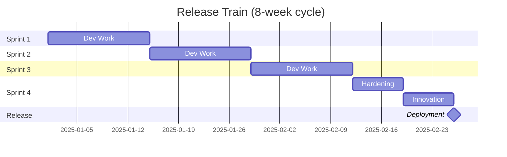

# Release Train & Cutover Checklist

## What is a Release Train?

A **Release Train** is a scheduled, recurring release cadence (e.g., every 2 weeks, monthly, quarterly) that synchronizes multiple teams' deliverables into a single coordinated release.

### Benefits
- **Predictability**: Stakeholders know when features ship
- **Coordination**: Aligns frontend, backend, infra, and QA teams
- **Risk reduction**: Smaller, frequent releases vs. big-bang deploys
- **Planning**: Business can align marketing/sales with release dates

### SAFe Agile Release Train (ART)


## Release Types

### 1. Standard Release (Planned)
- **Frequency**: Every 2-4 weeks
- **Process**: Full testing, UAT, approval
- **Risk**: Low (tested in staging)
- **Examples**: New features, enhancements

### 2. Expedited Release (Fast-Track)
- **Frequency**: As needed (1-3 days)
- **Process**: Abbreviated testing, CAB review
- **Risk**: Medium (less testing time)
- **Examples**: Critical bug fixes, compliance updates

### 3. Emergency Release (Hotfix)
- **Frequency**: Immediate (< 24 hours)
- **Process**: Post-implementation CAB review
- **Risk**: High (minimal testing)
- **Examples**: Security patches, production outages

## Cutover Checklist

### Pre-Cutover (T-7 Days)

- [ ] **Release notes** finalized and reviewed
- [ ] **Change tickets** (ServiceNow, Jira) approved by CAB
- [ ] **Communication plan** sent to stakeholders
- [ ] **Rollback plan** documented and tested
- [ ] **Database migrations** reviewed (forward + backward compatible)
- [ ] **Feature flags** configured (enable/disable without deploy)
- [ ] **Smoke test scripts** prepared
- [ ] **Monitoring alerts** updated (error thresholds, SLOs)
- [ ] **On-call rotation** scheduled

### Cutover Day (T-0)

#### 1 Hour Before Deployment
- [ ] **Freeze code**: No new merges to main branch
- [ ] **Backup databases** and critical data
- [ ] **Scale up resources** (if expecting traffic spike)
- [ ] **Alert support teams** (L1, L2, L3 on standby)
- [ ] **Verify artifact** (checksum, version tag)

#### During Deployment (15-30 min window)
- [ ] **Maintenance mode** (if needed): Display "Under maintenance" page
- [ ] **Deploy to first zone** (blue-green or canary)
- [ ] **Run smoke tests** on deployed zone
- [ ] **Check logs** for errors (ELK, Splunk, CloudWatch)
- [ ] **Monitor metrics** (latency, error rate, CPU, memory)
- [ ] **Gradual traffic shift** (5% → 25% → 50% → 100%)

#### Post-Deployment (1 Hour After)
- [ ] **Verify functionality** (login, checkout, API health)
- [ ] **Check transaction volumes** (compare to baseline)
- [ ] **Review error logs** (any new exceptions?)
- [ ] **Test rollback procedure** (dry run, no actual rollback)
- [ ] **Close maintenance window**
- [ ] **Update status page** (e.g., status.mycompany.com)
- [ ] **Notify stakeholders** (email, Slack)

### Post-Cutover (T+1 Day)

- [ ] **Monitor for 24-48 hours** (watch for delayed issues)
- [ ] **Review metrics** (compare pre/post release)
- [ ] **Customer feedback** (support tickets, social media)
- [ ] **Postmortem** (if issues occurred)
- [ ] **Close change tickets**
- [ ] **Archive release artifacts**

## Rollback Plan

### Triggers for Rollback
- **Error rate > 5%** (compared to baseline)
- **Latency > 2x normal**
- **Failed transactions > 10%**
- **Critical bug** (data corruption, security breach)
- **Business decision** (CEO says "revert now")

### Rollback Procedures

#### Kubernetes (kubectl)
```bash
# List deployment history
kubectl rollout history deployment/myapp

# Rollback to previous version
kubectl rollout undo deployment/myapp

# Rollback to specific revision
kubectl rollout undo deployment/myapp --to-revision=3

# Verify rollback
kubectl rollout status deployment/myapp
```

#### Docker Swarm
```bash
# Rollback to previous service version
docker service rollback myapp

# Or manually update to previous image
docker service update --image myapp:v1.2.3 myapp
```

#### Blue-Green (AWS ALB)
```bash
# Switch target group back to blue environment
aws elbv2 modify-rule --rule-arn <RULE_ARN> \
  --actions TargetGroupArn=<BLUE_TG_ARN>
```

#### Database Rollback (Risky!)
```sql
-- If migration was forward-compatible:
-- Just deploy old app version (no DB changes needed)

-- If migration broke compatibility:
-- Run reverse migration (must be tested beforehand!)
-- Example: Flyway
flyway undo -target=<previous_version>
```

## Communication Templates

### Pre-Release Notification

> **Subject**: Upcoming Release — [Date] at [Time]  
> 
> **Release Window**: [Start Time] - [End Time] (EST)  
> **Expected Downtime**: None (rolling deployment)  
> **Impact**: New features, bug fixes (see release notes)  
> **Rollback Plan**: Available if issues detected  
> **Support Contact**: [On-call engineer + phone]  
> 
> **Release Notes**: [Link to Confluence/Notion]  
> **Status Page**: [status.mycompany.com]

### Post-Release Success

> **Subject**: ✅ Release Complete — [Version]  
> 
> The [Version] release completed successfully at [Time].  
> **Deployed Changes**: [Summary]  
> **Monitoring**: All metrics normal  
> **Known Issues**: None  
> 
> Thank you to the [Team] for a smooth deployment!

### Incident Notification (Rollback)

> **Subject**: 🚨 Release Rollback Initiated — [Version]  
> 
> We detected [Issue] after deploying [Version].  
> **Action**: Rolled back to [Previous Version] at [Time]  
> **Impact**: [User-facing issues, if any]  
> **Status**: Service restored, investigating root cause  
> **Postmortem**: Will be shared by [Date]

## CAB (Change Advisory Board) Process

### CAB Meeting Agenda
1. **Review RFC** (Request for Change)
2. **Assess risk** (low/medium/high)
3. **Verify testing** (unit, integration, UAT)
4. **Check dependencies** (other releases, infrastructure)
5. **Approve/reject/defer**

### RFC Template

| Field | Value |
|-------|-------|
| **Change ID** | CHG0001234 |
| **Requestor** | Jane Doe (Engineering) |
| **Change Type** | Standard Release |
| **Risk Level** | Low |
| **Implementation Date** | 2025-10-15, 2:00 AM EST |
| **Duration** | 30 minutes |
| **Rollback Plan** | kubectl rollout undo |
| **Testing** | Passed UAT, staging smoke tests |
| **Impact** | No downtime expected |

## Metrics to Track

| Metric | Target | Why It Matters |
|--------|--------|----------------|
| **Deployment Frequency** | Weekly+ | Faster feedback loop |
| **Lead Time** | < 1 week | From code commit to production |
| **Change Failure Rate** | < 15% | Percentage of releases requiring rollback |
| **MTTR** (Mean Time to Restore) | < 1 hour | How fast can you rollback? |
| **Deployment Duration** | < 30 min | Shorter window = less risk |

## FAQs

**Q: How often should we release?**  
A: Start with monthly, then move to biweekly. Elite teams release multiple times per day.

**Q: What if a team misses the release train?**  
A: Their features wait until the next train (or go in a hotfix if critical).

**Q: Should we always rollback on errors?**  
A: Not always. Minor issues can be fixed forward (quick patch). Rollback for critical issues only.

**Q: How do we handle database migrations?**  
A: Make migrations backward-compatible (new columns nullable, old columns deprecated gradually).

## Further Reading

- [SAFe Release Train](https://scaledagileframework.com/agile-release-train/)
- [ITIL Change Management](https://www.axelos.com/certifications/itil-service-management)
- [Accelerate (Book)](https://www.amazon.com/Accelerate-Software-Performing-Technology-Organizations/dp/1942788339)
