# SonarQube Quality Gates

## What is SonarQube?

**SonarQube** is a code quality and security analysis platform that performs **SAST (Static Application Security Testing)** to detect:
- **Bugs**: Logic errors, null pointer exceptions
- **Vulnerabilities**: SQL injection, XSS, hardcoded secrets
- **Code smells**: Poor design, duplicated code, complex methods
- **Security hotspots**: Potential weak points needing manual review
- **Technical debt**: Time needed to fix all issues

## Quality Gates

A **Quality Gate** is a set of rules that must be passed before code can be merged or deployed.

### Default Quality Gate Conditions

| Metric | Threshold | Description |
|--------|-----------|-------------|
| **Coverage** | ≥ 80% | % of code covered by tests |
| **Duplicated Lines** | ≤ 3% | % of duplicated code |
| **Maintainability Rating** | ≥ A | Code smell severity (A-E) |
| **Reliability Rating** | ≥ A | Bug severity (A-E) |
| **Security Rating** | ≥ A | Vulnerability severity (A-E) |
| **Security Hotspots Reviewed** | 100% | All hotspots reviewed by humans |

### Ratings Explained

```mermaid
graph LR
    A[Code] --> B{Issues Found?}
    B -->|0 issues| C[A Rating ✅]
    B -->|1-10 minor| D[B Rating ⚠️]
    B -->|1+ major| E[C Rating 🚨]
    B -->|1+ critical| F[D/E Rating ❌]
```



- **A**: No issues or only info-level
- **B**: At least one minor issue
- **C**: At least one major issue
- **D**: At least one critical issue
- **E**: At least one blocker issue

## CI/CD Integration

### GitHub Actions Example

```yaml
name: SonarQube Scan
on:
  pull_request:
    branches: [main]
  push:
    branches: [main]

jobs:
  sonarqube:
    runs-on: ubuntu-latest
    steps:
      - uses: actions/checkout@v4
        with:
          fetch-depth: 0  # Full history for blame info
      
      - name: Set up JDK 17
        uses: actions/setup-java@v4
        with:
          java-version: 17
      
      - name: Cache SonarQube packages
        uses: actions/cache@v4
        with:
          path: ~/.sonar/cache
          key: ${{ runner.os }}-sonar
      
      - name: Run Tests with Coverage
        run: mvn clean verify  # Generates coverage report
      
      - name: SonarQube Scan
        env:
          SONAR_TOKEN: ${{ secrets.SONAR_TOKEN }}
          SONAR_HOST_URL: ${{ secrets.SONAR_HOST_URL }}
        run: |
          mvn sonar:sonar \
            -Dsonar.projectKey=my-project \
            -Dsonar.organization=my-org \
            -Dsonar.host.url=$SONAR_HOST_URL \
            -Dsonar.token=$SONAR_TOKEN \
            -Dsonar.qualitygate.wait=true  # Fail build if QG fails
```

### Fail Fast on Quality Gate

```yaml
# Prevent merge if Quality Gate fails
- name: Check Quality Gate
  run: |
    STATUS=$(curl -s -u $SONAR_TOKEN: "$SONAR_HOST_URL/api/qualitygates/project_status?projectKey=my-project" | jq -r '.projectStatus.status')
    if [ "$STATUS" != "OK" ]; then
      echo "❌ Quality Gate failed: $STATUS"
      exit 1
    fi
    echo "✅ Quality Gate passed"
```

## Custom Quality Gates

### Create Custom Gate for Microservices

```java
// SonarQube API (Java example)
QualityGate customGate = new QualityGate()
  .setName("Microservice Gate")
  .addCondition(new Condition()
    .setMetric("new_coverage")
    .setOperator("LESS_THAN")
    .setErrorThreshold("80"))  // New code must have 80% coverage
  .addCondition(new Condition()
    .setMetric("new_security_rating")
    .setOperator("GREATER_THAN")
    .setErrorThreshold("1"))  // A rating required
  .addCondition(new Condition()
    .setMetric("new_duplicated_lines_density")
    .setOperator("GREATER_THAN")
    .setErrorThreshold("3"));  // Max 3% duplication
```

### Quality Gate for Legacy Code

```yaml
# Relaxed standards for brownfield projects
conditions:
  - metric: new_coverage  # Only check NEW code
    operator: LESS_THAN
    error: 60  # Lower threshold (60% vs 80%)
  
  - metric: new_bugs
    operator: GREATER_THAN
    error: 0  # No new bugs allowed
  
  - metric: new_vulnerabilities
    operator: GREATER_THAN
    error: 0  # No new security issues
```

## Security Analysis

### OWASP Top 10 Detection

SonarQube detects vulnerabilities from OWASP Top 10:

#### 1. SQL Injection

```java
// ❌ Vulnerable (concatenated query)
String query = "SELECT * FROM users WHERE username='" + username + "'";
Statement stmt = connection.createStatement();
ResultSet rs = stmt.executeQuery(query);

// ✅ Fixed (prepared statement)
String query = "SELECT * FROM users WHERE username=?";
PreparedStatement stmt = connection.prepareStatement(query);
stmt.setString(1, username);
ResultSet rs = stmt.executeQuery();
```

#### 2. XSS (Cross-Site Scripting)

```javascript
// ❌ Vulnerable (unsanitized input)
document.getElementById("output").innerHTML = userInput;

// ✅ Fixed (sanitized)
document.getElementById("output").textContent = userInput;
// Or use DOMPurify library
document.getElementById("output").innerHTML = DOMPurify.sanitize(userInput);
```

#### 3. Hardcoded Secrets

```python
# ❌ Vulnerable (secret in code)
API_KEY = "sk_live_abc123xyz"

# ✅ Fixed (environment variable)
import os
API_KEY = os.environ.get("API_KEY")
```

### Security Hotspots

**Manual review required**:

```java
// SonarQube flags this as Security Hotspot
// Requires manual review to confirm it's safe
String password = getPasswordFromUser();
MessageDigest md = MessageDigest.getInstance("MD5");  // Weak hash
byte[] hash = md.digest(password.getBytes());

// Reviewer marks as "Safe" if:
// - Not used for production passwords (e.g., test data)
// - Or upgrades to bcrypt/Argon2
```

## Technical Debt

### Debt Calculation

```
Technical Debt = Time to fix all issues

Example:
- 50 bugs × 20 min each = 16.7 hours
- 200 code smells × 10 min each = 33.3 hours
Total Debt: 50 hours (6.25 days)
```

### Debt Ratio

```
Debt Ratio = (Remediation Cost / Development Cost) × 100%

Ratings:
- A: ≤ 5% (Excellent)
- B: 6-10% (Good)
- C: 11-20% (Needs improvement)
- D: 21-50% (High risk)
- E: > 50% (Critical)
```

## Best Practices

### 1. Incremental Improvement


Don't try to fix everything at once. Focus on:
1. **Security** (critical/high vulnerabilities)
2. **Bugs** (blocker/critical)
3. **New code** (prevent new debt)
4. **Legacy code** (gradual cleanup)

### 2. Developer Training

```bash
# Run SonarLint locally (IDE plugin)
# Catches issues BEFORE commit

# IntelliJ IDEA / VSCode / Eclipse
# Install SonarLint plugin
# Connect to SonarQube server
# Real-time feedback while coding
```

### 3. Code Review Integration

```yaml
# Pull Request checks
- name: SonarQube PR Analysis
  run: |
    mvn sonar:sonar \
      -Dsonar.pullrequest.key=${{ github.event.pull_request.number }} \
      -Dsonar.pullrequest.branch=${{ github.head_ref }} \
      -Dsonar.pullrequest.base=${{ github.base_ref }}
```

SonarQube comments directly on PR:
> **SonarQube Analysis**  
> ❌ 3 new bugs found  
> ⚠️ 5 new code smells  
> ✅ No security vulnerabilities  
> [View Details →](https://sonarqube.com/project/my-app)

### 4. Exclude Generated Code

```properties
# sonar-project.properties
sonar.exclusions=**/generated/**,**/node_modules/**,**/*.test.js
sonar.coverage.exclusions=**/test/**,**/*.test.ts
sonar.cpd.exclusions=**/migrations/**  # Skip duplication check for DB migrations
```

## Dashboard & Reports

### Executive Dashboard

| Project | Quality Gate | Coverage | Bugs | Vulnerabilities | Debt |
|---------|--------------|----------|------|-----------------|------|
| Payment API | ✅ Passed | 85% | 2 | 0 | 12h |
| Frontend | ⚠️ Failed | 65% | 8 | 1 | 40h |
| Auth Service | ✅ Passed | 92% | 0 | 0 | 5h |

### Trend Analysis

```
Code Coverage (last 30 days)
60% ─────────────────────
65% ───────────────────██─
70% ─────────────────████─
75% ───────────────██████─
80% ─────────────████████─
    Oct 1          Oct 30
```

## Troubleshooting

### Quality Gate Always Fails

**Issue**: Coverage never reaches 80%

**Solution**:
```properties
# Adjust gate for new code only
sonar.qualitygate.condition=new_coverage>70
# OR exclude test/infrastructure code
sonar.coverage.exclusions=**/test/**,**/config/**
```

### False Positives

```java
// Mark as false positive in SonarQube UI
// Or suppress in code (use sparingly)
@SuppressWarnings("java:S1234")  // Rule ID from SonarQube
public void methodWithFalsePositive() {
    // Code that triggers false positive
}
```

### Slow Scans

```yaml
# Speed up scans
- Use incremental analysis (PRs only scan changed files)
- Enable parallel processing: sonar.cpd.java.threads=4
- Exclude large files: sonar.exclusions=**/*.min.js
```

## FAQs

**Q: Should we fail builds on Quality Gate failures?**  
A: Yes for main branch. Optional for feature branches (warning only).

**Q: How often should we run SonarQube?**  
A: On every commit to main, and on every PR.

**Q: Can we customize rules?**  
A: Yes, create custom rule profiles or disable specific rules.

**Q: How do we handle legacy code?**  
A: Use "new code" metrics + gradual improvement. Don't fix everything at once.

## Further Reading

- [SonarQube Official Docs](https://docs.sonarqube.org/)
- [OWASP Top 10](https://owasp.org/www-project-top-ten/)
- [SonarLint (IDE Plugin)](https://www.sonarlint.org/)
