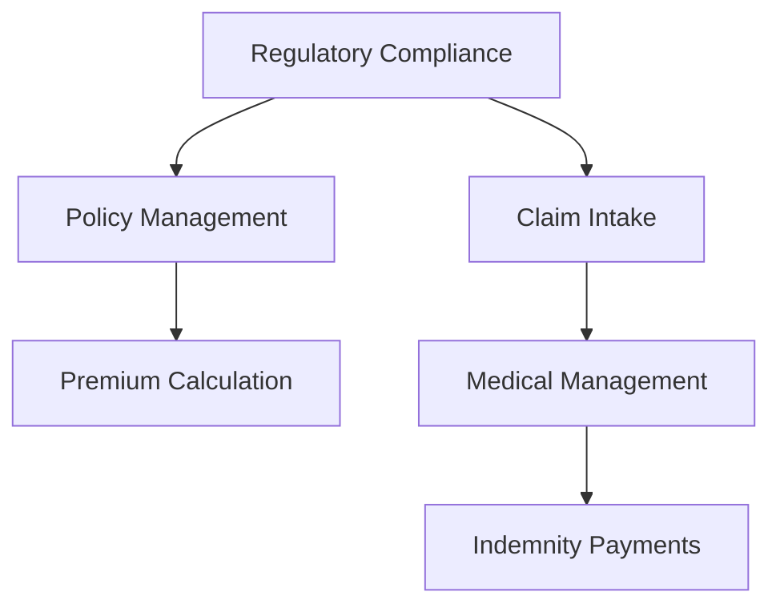

# Workers' Comp Insurance Systems

## Core Components

## System Integration

- **Guidewire ClaimCenter**: Claims processing
- **EDI 837/835**: Medical billing
- **State Compliance Engines**: Filing requirements

## Further Reading

- [NCCI Documentation](https://www.ncci.com/)
